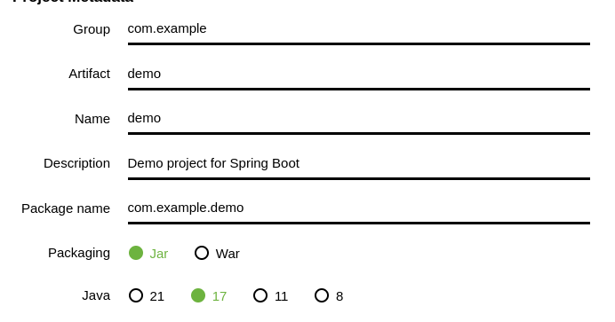
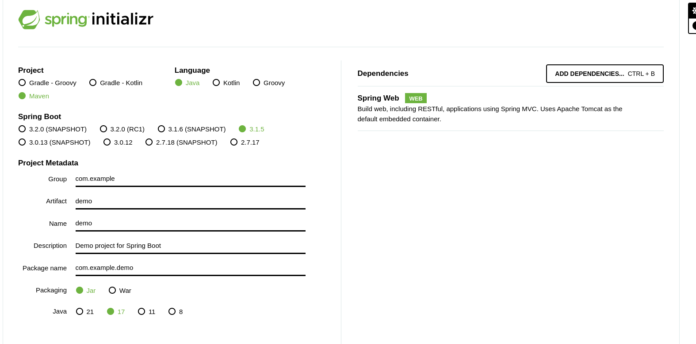
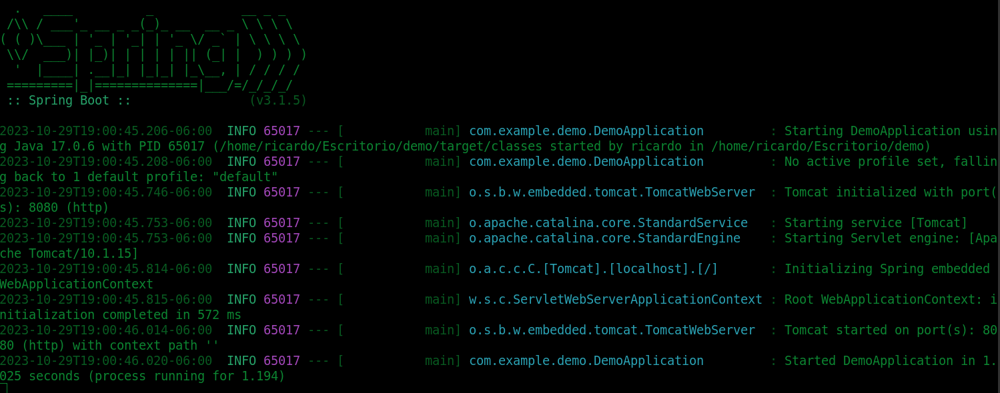
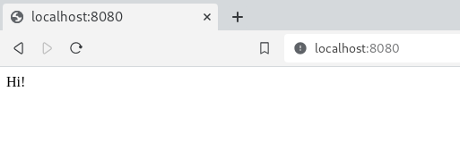

Spring Boot is one of the best frameworks for building web applications. It has a great web page for creating a boilerplate to start a project.

So, good news, creating an application with this framework is really easy.

## **Step 1 Open Spring initializr**

The first thing you need to do is open this web page on your browser:

[https://start.spring.io/](https://start.spring.io/)


## **Step 2 Setup your project**

Next you have to specify the following parameters:

- Project: Maven

- Language: Java or Kotlin (if you prefer)

- Spring boot: Current new versión is 3.15

- Project Metadata: Replace according your needs



Package: use jar if you web server would be inside the jar package, use war if you have the web server outside the package.

Java: try to use a recent versión of java like 17 or 21

Dependencies: Select Spring web dependency

It should look like the image below



## **Step 3 Create a end point**

Add a SayHi class with the @RestController annotation. This indicates that this class contains an end point. Then add a method the @GetMapping annotation. This indicates that the method will handle the request of the specified path

```java

@RestController
public class SayHi {

    @GetMapping("/")
    public String hi() {
      return String.format("Hi!");
    }
    
}
```

## **Step 4 Run the application**

First install maven dependencies using

```java
./mvnw install
```

Then run the application using

```java
./mvnw spring-boot:run
```



Finally, open a web browser and you will see this:


