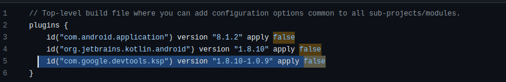
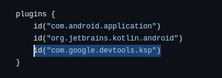
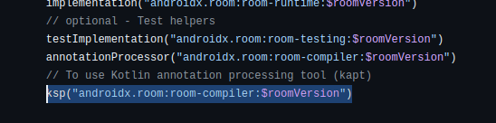

Nowadays Room is one of the preferred libraries for handling SQLite in Android. One common exception is the following.

_FATAL EXCEPTION: main Process: com.thisisthetime.controlinversiones, PID: 10446 java.lang.RuntimeException: Cannot find implementation for com.mypackage.AppDatabase. AppDatabase\_Impl does not exist at androidx.room.Room.getGeneratedImplementation(Room.kt:58) at androidx.room.RoomDatabase$Builder.build(RoomDatabase.kt:1357)_

This is caused when you want to create your database like this

```kotlin
val database: AppDatabase =  
        Room.databaseBuilder(
            context,
            AppDatabase::class.java, "controlinversionesdb"
        )
        .build()
```

And the error is caused because you need to add a depencency to resolve the room annotations. In this case we are going to use Kotlin Symbol Processing

In the outter build.gradle.kts add



In the inner build.gradle.kts add



Sync your project and then add this dependency



This will fix the issue
