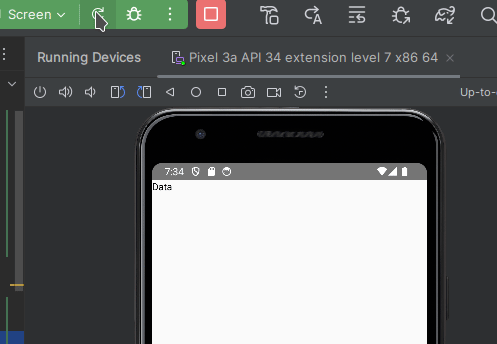

When using suspend functions inside composables a common error is the following:

_Suspend function should be called only from a coroutine or another suspend function_

You can reproduce this error with a code like this:

```kotlin
suspend fun getData(): String {
    delay(1000L)
    return "Data"
}

@Composable
fun Screen() {
    val data = getData() // Suspend function 'getData' should be called...
    Text(data)
}

```

So, you need to call _getData()_ inside the launch function of a coroutine. You can use rememberCoroutineScope for this

```kotlin
@Composable
fun Screen() {
    val scope = rememberCoroutineScope()

    scope.launch { // Calls to launch should happen inside a LaunchedEffect and not composition
        val data = getData() 
    }

    Text(data)
}
```

Now you will get the error _Calls to launch should happen inside a LaunchedEffect and not composition_, so let use the LaunchedEffect function

```kotlin
@Composable
fun Screen() {
    val scope = rememberCoroutineScope()

    LaunchedEffect(scope) {
        val data = getData()
    }

    Text(data)
}
```

Finally, you can save the variable data as a State variable in order that the screen recompose when data changes its value

```kotlin
@Preview
@Composable
fun Screen() {
    val scope = rememberCoroutineScope()
    val data = remember { mutableStateOf("")}
    LaunchedEffect(scope) {
        data.value = getData()
    }

    Text(data.value)
}
```


