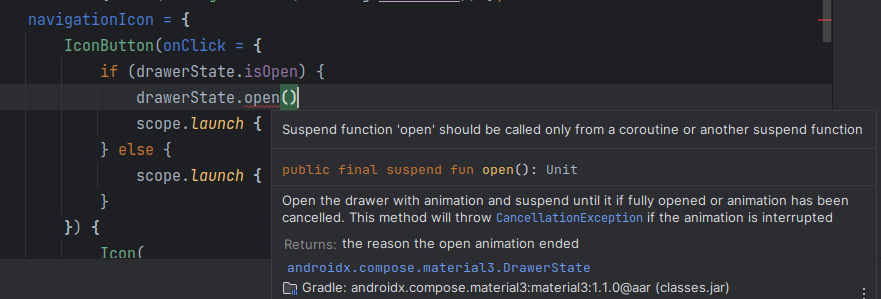

Jetpack Compose improve the way Android app developers create user interfaces allowing developers to build the user interface using a programming sintaxis.

On common error using Jetpack compose is when you try to use suspend functions inside a composable. The error looks like this:

> _Suspend function 'function' should be called only from a coroutine or another suspend function_



An easy workaround for this is using the _rememberCoroutineScope()_ function

```
val scope = rememberCoroutineScope()
```

Then wrap your code like this

```
scope.launch { /* Put your code here */ }
```
