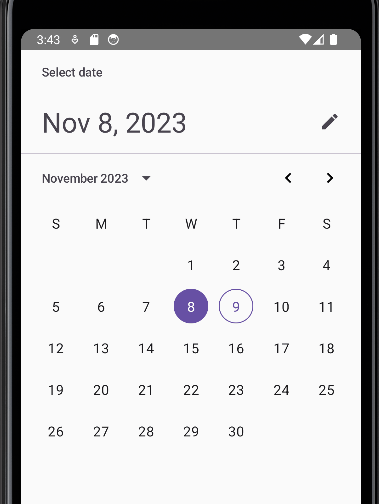
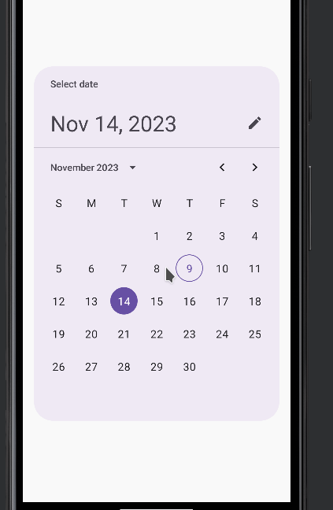
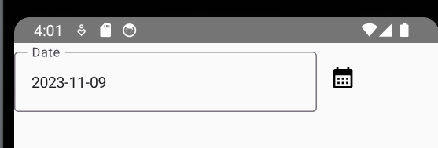
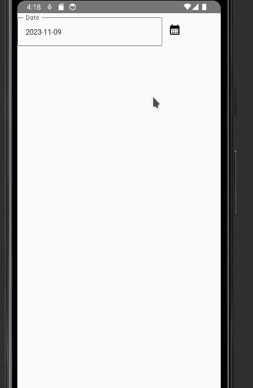

Material3 has two components that are easy to use when we need to use dates.

- **DatePicker**

- **DialogDatePicker**

## DatePicker

This component is straightforward to use. With just few lines you can have basic functionality

```
@OptIn(ExperimentalMaterial3Api::class)
@Composable
fun CustomDatePicker() {
    val state = rememberDatePickerState()
    DatePicker(state = state)
}
```



## DatePickerDialog

This component it is just a dialog for holding the datepicker

```
@OptIn(ExperimentalMaterial3Api::class)
@Composable
fun CustomDatePicker() {
    val state = rememberDatePickerState()
    DatePickerDialog(
        onDismissRequest = {  },
        confirmButton = { }) {
      DatePicker(state = state)
    }
}
```



Using both components we can build a a custom datepicker acording our requeriment. In my case, I just needed a TextField that shows the Date and that shows the Dialog when it is clicked.

1\. First, we put a TextField and a Button

```
val date = remember { mutableStateOf(LocalDate.now())}
    Row(verticalAlignment = Alignment.CenterVertically) {
        OutlinedTextField(
            readOnly = true,
            value = date.value.format(DateTimeFormatter.ISO_DATE),
            label = { Text("Date") },
            onValueChange = {})
        IconButton(
            onClick = { }
        ) {
            Icon(imageVector = Icons.Default.CalendarMonth, contentDescription = "Calendar")
        }
    }
```



2\. Next, we add a new composable with the dialog

```
@OptIn(ExperimentalMaterial3Api::class)
@Composable
fun CustomDatePickerDialog(
    onAccept: (Long?) -> Unit,
    onCancel: () -> Unit
) {
    val state = rememberDatePickerState()
    
    DatePickerDialog(
        onDismissRequest = { },
        confirmButton = {
            Button(onClick = { onAccept(state.selectedDateMillis) }) {
                Text("Accept")
            }
        },
        dismissButton = {
            Button(onClick = onCancel) {
                Text("Cancel")
            }
        }
    ) {
        DatePicker(state = state)
    }
}
```

3\. Then we add a variable to show/hide the dialog

```
val isOpen = remember { mutableStateOf(false)}
```

And we set the value using the onAccept and onCancel events

```
@Composable
fun CustomDatePicker() {
    val date = remember { mutableStateOf(LocalDate.now())}
    val isOpen = remember { mutableStateOf(false)}
    Row(verticalAlignment = Alignment.CenterVertically) {

        OutlinedTextField(
            readOnly = true,
            value = date.value.format(DateTimeFormatter.ISO_DATE),
            label = { Text("Date") },
            onValueChange = {})

        IconButton(
            onClick = { isOpen.value = true } // show de dialog
        ) {
            Icon(imageVector = Icons.Default.CalendarMonth, contentDescription = "Calendar")
        }
    }

    if (isOpen.value) {
        CustomDatePickerDialog(
            onAccept = {
                isOpen.value = false // close dialog
            },
            onCancel = {
                isOpen.value = false //close dialog
            }
        )
    }
}
```



4\. Finally, we set the value in the TextField

```
CustomDatePickerDialog(
        onAccept = {
            isOpen.value = false // close dialog

            if (it != null) { // Set the date
                date.value = Instant
                    .ofEpochMilli(it)
                    .atZone(ZoneId.of("UTC"))
                    .toLocalDate()
            }
        },
        onCancel = {
            isOpen.value = false //close dialog
        }
    )
```

The whole code looks like this

```
@Composable
fun CustomDatePicker() {
    val date = remember { mutableStateOf(LocalDate.now())}
    val isOpen = remember { mutableStateOf(false)}

    Row(verticalAlignment = Alignment.CenterVertically) {

        OutlinedTextField(
            readOnly = true,
            value = date.value.format(DateTimeFormatter.ISO_DATE),
            label = { Text("Date") },
            onValueChange = {})

        IconButton(
            onClick = { isOpen.value = true } // show de dialog
        ) {
            Icon(imageVector = Icons.Default.CalendarMonth, contentDescription = "Calendar")
        }
    }

    if (isOpen.value) {
        CustomDatePickerDialog(
            onAccept = {
                isOpen.value = false // close dialog

                if (it != null) { // Set the date
                    date.value = Instant
                        .ofEpochMilli(it)
                        .atZone(ZoneId.of("UTC"))
                        .toLocalDate()
                }
            },
            onCancel = {
                isOpen.value = false //close dialog
            }
        )
    }
}

@OptIn(ExperimentalMaterial3Api::class)
@Composable
fun CustomDatePickerDialog(
    onAccept: (Long?) -> Unit,
    onCancel: () -> Unit
) {
    val state = rememberDatePickerState()

    DatePickerDialog(
        onDismissRequest = { },
        confirmButton = {
            Button(onClick = { onAccept(state.selectedDateMillis) }) {
                Text("Accept")
            }
        },
        dismissButton = {
            Button(onClick = onCancel) {
                Text("Cancel")
            }
        }
    ) {
        DatePicker(state = state)
    }
}
```
