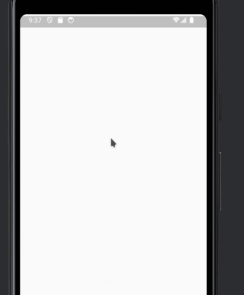
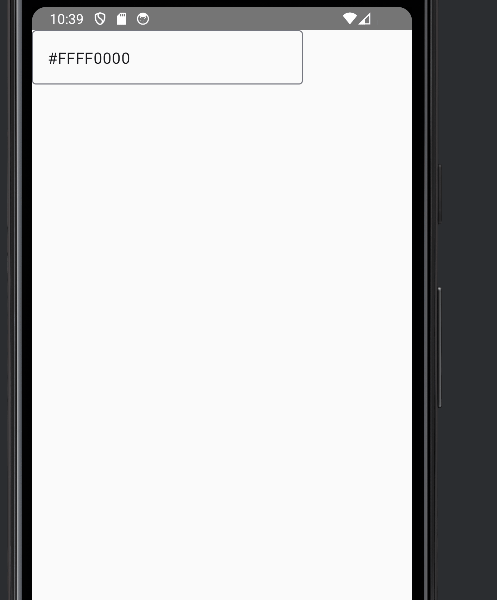

A common functionality in a mobile app is allowing users to choose a color. Sometimes, you need a composable according to these needs

- A field where to place the description of the colors

- A dialog to choose the color

For the dialog, we are going to use the library in this github repo:  
[https://github.com/maxkeppeler/sheets-compose-dialogs/tree/main](https://github.com/maxkeppeler/sheets-compose-dialogs/tree/main)

First, lets add the dependencies of the library

```kotlin
implementation("com.maxkeppeler.sheets-compose-dialogs:core:1.2.0")
implementation("com.maxkeppeler.sheets-compose-dialogs:color:1.2.0")
```

In the github repo there are many examples for color dialogs, so lets try the next one

```kotlin
@OptIn(ExperimentalMaterial3Api::class)
@Composable
fun ColorPicker() {
    val color = remember { mutableStateOf(Color.Red.toArgb()) }
    ColorDialog(
        state = rememberUseCaseState(visible = true, onCloseRequest = { }),
        selection = ColorSelection(
            selectedColor = SingleColor(color.value),
            onSelectColor = { color.value = it },
        ),
        config = ColorConfig(
            defaultDisplayMode = ColorSelectionMode.CUSTOM,
            allowCustomColorAlphaValues = false
        ),
    )
}
```

This is how it looks like



Next, we add a textfield for the description

```kotlin
 OutlinedTextField(
        value = "#${color.value.toHexString().uppercase()}",
        onValueChange = {}
  )
```

And we add the events to open the dialog. We want that the dialog opens when the TextField is clicked. We add a state variable for this

```kotlin
val open = remember { mutableStateOf(false) }
```

And we implement the click event

```kotlin
OutlinedTextField(
        modifier = Modifier.clickable { open.value = true },
        value = "#${color.value.toHexString().uppercase()}",
        onValueChange = {}
    )
```

You will notice that the click event does not work. You need to add the enable=false attribute and fix the colors.

```kotlin
OutlinedTextField(
        enabled = false, // Add this to make click event work
        modifier = Modifier.clickable { open.value = true },
        value = "#${color.value.toHexString().uppercase()}",
        onValueChange = {},
        colors = OutlinedTextFieldDefaults.colors( // Fixing the colors
            disabledTextColor = MaterialTheme.colorScheme.onSurface,
            disabledBorderColor = MaterialTheme.colorScheme.outline,
            disabledLeadingIconColor = MaterialTheme.colorScheme.onSurfaceVariant,
            disabledTrailingIconColor = MaterialTheme.colorScheme.onSurfaceVariant,
            disabledLabelColor = MaterialTheme.colorScheme.onSurfaceVariant,
            disabledPlaceholderColor = MaterialTheme.colorScheme.onSurfaceVariant,
        )
    )
```

We show the dialog only when open.value is true, and we set open.value=false when the dialog is closed

```kotlin
if (open.value) {
        ColorDialog(
            state = rememberUseCaseState(visible = true, onCloseRequest = { open.value = false }),

            selection = ColorSelection(
                selectedColor = SingleColor(color.value),
                onSelectColor = { color.value = it },
            ),
            config = ColorConfig(
                defaultDisplayMode = ColorSelectionMode.CUSTOM,
                allowCustomColorAlphaValues = false
            ),
        ) 
    }
```



Finally we add the value and onChange parameters

```kotlin
fun ColorPicker(
    value: Color,
    onChangeValue: (Color) -> Unit
)
```

And we can use it like this:

```kotlin
@Composable
@Preview
fun ColorPickerPreview() {
    val color = remember {mutableStateOf(Color.Red)}
    AppTheme {
        ColorPicker(
            value = color.value,
            onChangeValue = { color.value = it}
        )
    }
}
```

This is the whole code

```kotlin

import androidx.compose.foundation.clickable
import androidx.compose.material3.ExperimentalMaterial3Api
import androidx.compose.material3.MaterialTheme
import androidx.compose.material3.OutlinedTextField
import androidx.compose.material3.OutlinedTextFieldDefaults
import androidx.compose.runtime.Composable
import androidx.compose.runtime.mutableStateOf
import androidx.compose.runtime.remember
import androidx.compose.ui.Modifier
import androidx.compose.ui.graphics.Color
import androidx.compose.ui.graphics.toArgb
import androidx.compose.ui.tooling.preview.Preview
import com.maxkeppeker.sheets.core.models.base.rememberUseCaseState
import com.maxkeppeler.sheets.color.ColorDialog
import com.maxkeppeler.sheets.color.models.ColorConfig
import com.maxkeppeler.sheets.color.models.ColorSelection
import com.maxkeppeler.sheets.color.models.ColorSelectionMode
import com.maxkeppeler.sheets.color.models.SingleColor
import com.thisisthetime.controlinversiones.ui.theme.AppTheme
import okhttp3.internal.toHexString

@OptIn(ExperimentalMaterial3Api::class)
@Composable
fun ColorPicker(
    value: Color,
    onChangeValue: (Color) -> Unit
) {
    val open = remember { mutableStateOf(false) }

    OutlinedTextField(
        enabled = false, // Add this to make click event work
        modifier = Modifier.clickable { open.value = true },
        value = "#${value.toArgb().toHexString().uppercase()}",
        onValueChange = {},
        colors = OutlinedTextFieldDefaults.colors( // Fixing the colors
            disabledTextColor = MaterialTheme.colorScheme.onSurface,
            disabledBorderColor = MaterialTheme.colorScheme.outline,
            disabledLeadingIconColor = MaterialTheme.colorScheme.onSurfaceVariant,
            disabledTrailingIconColor = MaterialTheme.colorScheme.onSurfaceVariant,
            disabledLabelColor = MaterialTheme.colorScheme.onSurfaceVariant,
            disabledPlaceholderColor = MaterialTheme.colorScheme.onSurfaceVariant,
        )
    )

    if (open.value) {
        ColorDialog(
            state = rememberUseCaseState(visible = true, onCloseRequest = { open.value = false }),

            selection = ColorSelection(
                selectedColor = SingleColor(value.toArgb()),
                onSelectColor = { onChangeValue(Color(it))},
            ),
            config = ColorConfig(
                defaultDisplayMode = ColorSelectionMode.CUSTOM,
                allowCustomColorAlphaValues = false
            ),
        )
    }

}

@Composable
@Preview
fun ColorPickerPreview() {
    val color = remember {mutableStateOf(Color.Red)}
    AppTheme {
        ColorPicker(
            value = color.value,
            onChangeValue = { color.value = it}
        )
    }
}

```
