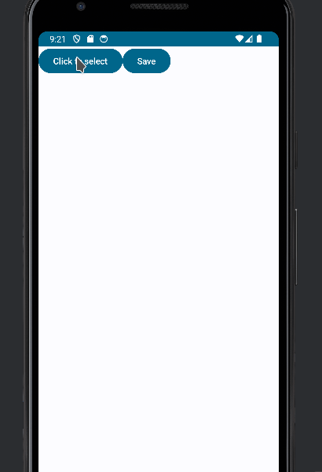

Storing Jetpack icons in a database is kind of easy. You need three main things:

- A table where to store the Icons

- Convert the icons to a string (We are going to store the icon as a String)

- Convert the string to an icon (When we retrieve the string we are going to covert it back to an Icon)

First, lets configure the database and the table. If you don't now how to configure Room, you can follow the oficial documentation:

[https://developer.android.com/training/data-storage/room](https://developer.android.com/training/data-storage/room)

Lets create the table

```kotlin
@Entity(tableName = "colors")
data class Color(
    @PrimaryKey(autoGenerate = true)
    var id: Long = 0,
    val name: String
)
```

This is the DAO

```kotlin
@Dao
interface ColorsDao {
    @Insert(onConflict = OnConflictStrategy.REPLACE)
    suspend fun insert(color: Color): Long

    @Query("SELECT * FROM colors")
     suspend fun getAll(): List<Color>
}
```

And this is the database

```kotlin

@Database(entities = [Color::class], version = 1)
abstract class AppDatabase : RoomDatabase() {
    abstract fun colorsDao(): ColorsDao
}
```

The basic idea to store the icons is get the name of the Icons in the _androidx.compose.material.icons_, then save those names and convert it back in icons when we need them. So, lets code some functions to do this.

First, lets code a function to get the name of the Icon:

```kotlin
fun getIconName(icon: ImageVector): String {
    return icon.name.split(".")[1]
}

// Usage
// val name: String = getIconName(Icons.Filled.Edit)
```

Now this is the code to convert the name of the icon to a ImageVector:

```kotlin
fun iconByName(name: String): ImageVector {
    val cl = Class.forName("androidx.compose.material.icons.filled.${name}Kt")
    val method = cl.declaredMethods.first()
    return method.invoke(null, Icons.Filled) as ImageVector
}

// Usage
// val icon: ImageVector = iconByName("Edit")
```

With the previous code we can store the names of the icons in the table and convert it back to icons. With this code we save the icon's name:

```kotlin
suspend fun saveIcon(db: AppDatabase, icon: ImageVector) {
    val name = getIconName(icon)
    val dao = db.colorsDao()

    dao.insert(Color(name = name))
}
```

This is the code to get the icons form the database

```kotlin
suspend fun getIcons(db: AppDatabase): List<ImageVector> {
     val records = db.colorsDao().getAll()

    return records.map {
        iconByName(it.name)
    }
}
```

Lets build a simple example to use the code. We are going to show to the user a list of icons, once he selected one, then we are going to store it to the data base and show the stored icons.

We want a composable to pick the icons like this

```kotlin
@Composable
fun IconPicker(
    selectedIcon: ImageVector? = null,
    iconsToShow: List<ImageVector>,
    onSelectedIcon: (ImageVector) -> Unit
) {
}
```

Inside of the composable we are going to put a dropdown with the icons like this

```kotlin
DropdownMenu(
    expanded = expanded,
    onDismissRequest = { expanded = false }
) {
    iconsToShow.forEach {
        DropdownMenuItem(
            text = {
                Row(verticalAlignment = Alignment.CenterVertically) {
                    Icon(it, it.name)
                    Text(text = it.name)
                }
            },

            onClick = {
                onSelectedIcon(it)
                expanded = false
            }
        )
    }
}
```

Once the icon is selected we are going to use a button to save it

```kotlin
Button(onClick = {
    scope.launch {
        selectedIcon?.let { saveIcon(db, it) }
        savedColors = getIcons(db)
    }
}) {
    Text("Save")
}
```

Finally we are going to show the saved icons

```kotlin
savedColors.forEach {
    Row() {
        Icon(it, it.name)
        Text(it.name)
    }
}
```

This is how the example looks like



You can see the whole code here:

[https://github.com/FractalCodeRicardo/RoomIcons](https://github.com/FractalCodeRicardo/RoomIcons)
