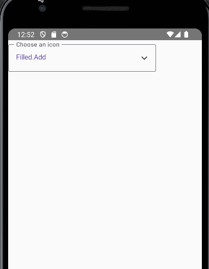
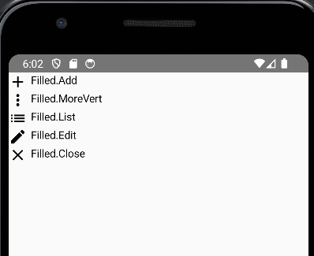
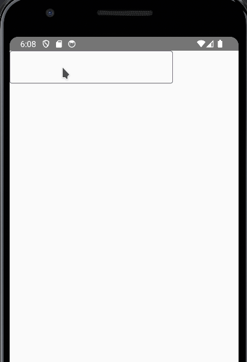
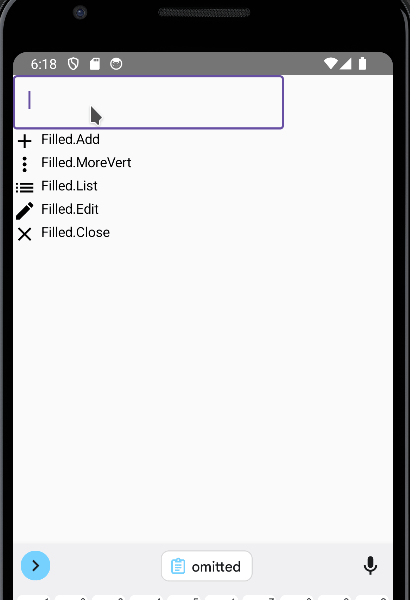

It would be great to let the users choose the icons that they want, so lets build a icon picker with the following functionalities:

1. Search the icons while typing

3. Show a list preview of the icons

5. Let the user choose the icon

First, lets put in a list the icons that we want to show

```
val icons = listOf(
    Icons.Filled.Add,
    Icons.Filled.MoreVert,
    Icons.Filled.List,
    Icons.Filled.Edit,
    Icons.Filled.Close
)
```

Now we want a simple list that shows icons. Like this:

```
@Composable
fun IconList() {
    LazyColumn() {
        this.items(
            items = icons,
            itemContent = { icon ->
                Row() {
                        Icon(icon, icon.name)
                        Spacer(modifier = Modifier.width(5.dp))
                        Text(icon.name)
                    }
            }
        )
    }
}
```



Now we want a TextField that shows the icons when typing. Lets add the TextField and the code that shows the list on typing

```
var expanded by remember { mutableStateOf(true) }
    
Column {
    OutlinedTextField(
        value = selectedIcon,
        onValueChange = {
            expanded = true
        }
    )

    IconList(
        expanded = expanded,
        onSelected = { expanded = false }
    )
}
```

And we adapt our list to receive some parameters

```
fun IconList(
    expanded: Boolean,
    onSelected: (String) -> Unit,
    filter: String = ""
) {
    if (!expanded) {
        return
    }

    LazyColumn() {
      //Code omitted
    }
}
```



Now lets filter the results

```
var filter by remember { mutableStateOf(selectedIcon) }
```

```
OutlinedTextField(
    value = filter ,
    onValueChange = {
        expanded = true
        filter = it
    }
)
```

In the list we filter the items

```
LazyColumn() {
        this.items(
            items = icons.filter {
                it.name
                    .lowercase()
                    .contains(filter.lowercase())
            },
            // Code omitted        
        )
      }
```



I added some code to get a better look:

- I added a label on the textfield

- I change the text colors

- I add borders to the list

- I change the colors of the list

The final code is this

```

import androidx.compose.foundation.BorderStroke
import androidx.compose.foundation.clickable
import androidx.compose.foundation.layout.*
import androidx.compose.foundation.lazy.LazyColumn
import androidx.compose.foundation.lazy.items
import androidx.compose.foundation.shape.RoundedCornerShape
import androidx.compose.material.icons.Icons
import androidx.compose.material.icons.filled.Add
import androidx.compose.material.icons.filled.Close
import androidx.compose.material.icons.filled.Edit
import androidx.compose.material.icons.filled.KeyboardArrowDown
import androidx.compose.material.icons.filled.List
import androidx.compose.material.icons.filled.MoreVert
import androidx.compose.material3.ExperimentalMaterial3Api
import androidx.compose.material3.Icon
import androidx.compose.material3.MaterialTheme
import androidx.compose.material3.OutlinedTextField
import androidx.compose.material3.Surface
import androidx.compose.material3.Text
import androidx.compose.material3.TextFieldDefaults
import androidx.compose.runtime.Composable
import androidx.compose.runtime.getValue
import androidx.compose.runtime.mutableStateOf
import androidx.compose.runtime.remember
import androidx.compose.runtime.setValue
import androidx.compose.ui.Modifier
import androidx.compose.ui.tooling.preview.Preview
import androidx.compose.ui.unit.dp

val icons = listOf(
    Icons.Filled.Add,
    Icons.Filled.MoreVert,
    Icons.Filled.List,
    Icons.Filled.Edit,
    Icons.Filled.Close
)

@OptIn(ExperimentalMaterial3Api::class)
@Composable
fun IconPicker(
    selectedIcon: String,
    onIconSelected: (String) -> Unit
) {
    var expanded by remember { mutableStateOf(false) }
    var filter by remember { mutableStateOf(selectedIcon) }

    Column(
        modifier = Modifier.width(300.dp)
    ) {
        OutlinedTextField(
            modifier = Modifier.fillMaxWidth(),
            value = filter,
            onValueChange = {
                expanded = true
                filter = it
            },
            label = { Text("Choose an icon") },
            trailingIcon = {
                Column(
                    modifier = Modifier.clickable {
                        expanded = true
                    },
                ) {
                    Icon(Icons.Filled.KeyboardArrowDown, "Icon")
                }
            },
            colors = TextFieldDefaults.outlinedTextFieldColors(
                textColor = MaterialTheme.colorScheme.primary
            )
        )

        IconList(
            expanded = expanded,
            onSelected = {
                filter = it
                expanded = false
                onIconSelected(filter)
            },
            filter = filter
        )
    }
}

@Composable
fun IconList(
    expanded: Boolean,
    onSelected: (String) -> Unit,
    filter: String = ""
) {
    if (!expanded) {
        return
    }

    Surface(
        modifier = Modifier.fillMaxWidth(),
        shape = RoundedCornerShape(5.dp),

        contentColor = MaterialTheme.colorScheme.primary,
        color = MaterialTheme.colorScheme.surface,
        border = BorderStroke(1.dp, MaterialTheme.colorScheme.primary)

    ) {
        LazyColumn(modifier = Modifier.heightIn(max = 150.dp)) {
            this.items(
                items = icons.filter {
                    it.name
                        .lowercase()
                        .contains(filter.lowercase())
                },
                itemContent = { icon ->
                    Row(
                        modifier = Modifier.clickable {
                            onSelected(icon.name)
                        }
                    ) {
                        Icon(icon, icon.name)
                        Spacer(modifier = Modifier.width(5.dp))
                        Text(icon.name)
                    }
                }
            )
        }
    }

}

@Composable
@Preview
fun IconPickerPreview() {
    var icon by remember { mutableStateOf("Filled.Add") }
    IconPicker(
        selectedIcon = icon,
        onIconSelected = {
            icon = it
        }
    )
}
```


