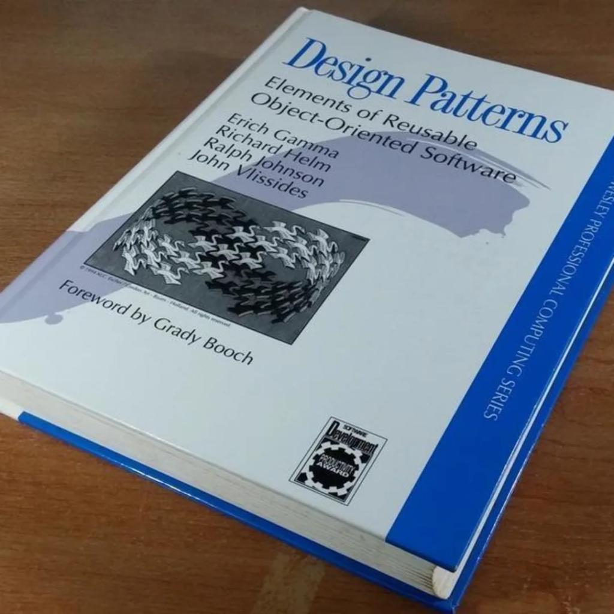
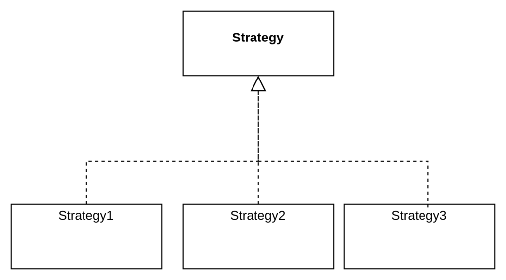
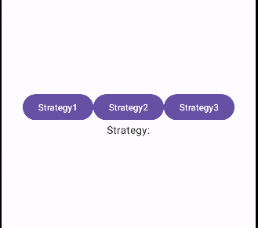

So you thought design patterns couldn't be used with composables, huh? Composables are functions. They are not classes or interfaces, so how can we achieve polymorphism?

The principle behind a lot of design patterns is to have a common interface or class that hides implementation. For example, in the image below, Strategy pattern has a common interface and three strategies.



The code that use the strategies never depends of the implementation of each strategy, instead depends of the Strategy Base. This base is a Class or Interface in a POO context, but **instead we can use a Composable as a common base.**

Lets code an example of a screen navigator. First lets build the Strategy Base

```
@Composable
fun StrategyBase(strategy: String) {
    if (strategy == "strategy1") {
        
    }

    if (strategy == "strategy2") {
        
    }

    if (strategy == "strategy3") {
      
    }
}
```

Now lets implement each Strategy

```
@Composable
fun Strategy1() {
    Text("Strategy 1")
}

@Composable
fun Strategy2() {
    Text("Strategy 2")
}

@Composable
fun Strategy3() {
    Text("Strategy 3")
}
```

The Strategy Base is modified

```
@Composable
fun StrategyBase(strategy: String) {
    if (strategy == "strategy1") {
        Strategy1()
        return
    }

    if (strategy == "strategy2") {
        Strategy2()
        return
    }

    if (strategy == "strategy3") {
        Strategy3()
        return
    }
}
```

Now lets code a client example. We are going to use some buttons to choose each strategy. Notice that the code client does not have references to each strategy, there is only a reference to the strategy base.

```
@Composable
fun StrategyClient() {

    var strategy by remember { mutableStateOf("") }
    Column(
        modifier = Modifier.fillMaxSize(),
        horizontalAlignment = Alignment.CenterHorizontally,
        verticalArrangement = Arrangement.Center
    ) {
        Row() {
            Button(onClick = { strategy = "strategy1" }) {
                Text("Strategy1")
            }

            Button(onClick = { strategy = "strategy2" }) {
                Text("Strategy2")
            }

            Button(onClick = { strategy = "strategy3" }) {
                Text("Strategy3")
            }
        }

        Text("Strategy:")
        StrategyBase(strategy)
    }

}
```

This is the example running


