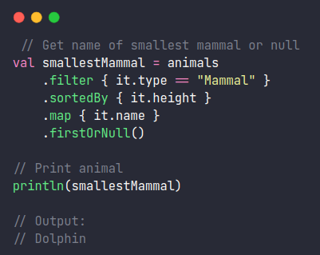

In you daily programming you will need filter, order, grouping, etc your collections. Here is a brief review of what you can do with the following collection-operations in kotlin:



- **Foreach**

- **Filter**

- **FirstOrNull** **or** **Find**

- **SortedBy**

- **Map**

- **MinBy**

- **MaxBy**

- **Sum**

- **Distinct**

- **Complex queries**

We are going to use this class and data for the examples:

```
data class Animal(
    val name: String = "",
    val type: String = "",
    val weight: Double = 0.0,
    val height: Double = 0.0
)

val animals = listOf(
    Animal(name = "Lion", type = "Mammal", weight = 190.0, height = 3.5),
    Animal(name = "Elephant", type = "Mammal", weight = 5000.0, height = 10.0),
    Animal(name = "Penguin", type = "Bird", weight = 1.5, height = 0.5),
    Animal(name = "Snake", type = "Reptile", weight = 10.0, height = 1.0),
    Animal(name = "Dolphin", type = "Mammal", weight = 300.0, height = 2.0),
    Animal(name = "Eagle", type = "Bird", weight = 5.0, height = 0.8),
    Animal(name = "Tiger", type = "Mammal", weight = 250.0, height = 3.0),
    Animal(name = "Crocodile", type = "Reptile", weight = 150.0, height = 2.5),
    Animal(name = "Giraffe", type = "Mammal", weight = 1200.0, height = 5.5),
    Animal(name = "Hawk", type = "Bird", weight = 2.0, height = 0.6),
    // Duplicated hawk
    Animal(name = "Hawk", type = "Bird", weight = 2.5, height = 0.6)
)
```

1. **Foreach**

It just iterate over the collection

```
// 1. Foreach
// Print the animal names

animals.forEach { print("${it.name} ") }

// Output:
// Lion Elephant Penguin Snake Dolphin Eagle Tiger Crocodile Giraffe Hawk Hawk
```

**2.** **Filter**

Filter over the collection using a condition

```
// 2. Filter
// Gets birds
val birds = animals
    .filter { it.type == "Bird" }

// Print the birds
birds.forEach { print("${it.name} ") }

// Output:
// Penguin Eagle Hawk Hawk
```

**3.** **FirstOrNull** or **Find**

Return the first element or null given a condition

```
// 3. Find or FirstOrNull
// Get first hawk o null
var hawk = animals.firstOrNull { it.name == "Hawk" }

// or
hawk = animals.find { it.name == "Hawk" }

// print hawk
hawk?.let { println(hawk) }

// Output:
// Animal(name=Hawk, type=Bird, weight=2.0, height=0.6)
```

**4.** **SortedBy**

Returns the elements _s_orted in ascending order using the selector specified

```
// 4. Order
// Get the smallest animals first
val smallestAnimalsFirst = animals.sortedBy { it.height }

// Print the animals names and heights
smallestAnimalsFirst.forEach { print("${it.name}(${it.height}) ") }

// Output:
// Penguin(0.5) Hawk(0.6) Hawk(0.6) Eagle(0.8) Snake(1.0) Dolphin(2.0) Crocodile(2.5) Tiger(3.0) Lion(3.5) Giraffe(5.5) Elephant(10.0)
```

**5\. Map**

Returns a new collection changing each element using the function specified

```
// 5. Map
// Get only names and types
val justNamesAndTypes = animals.map {
  object {
      val name = it.name
      val type = it.type
  }
}

// Print the animals names and types
justNamesAndTypes.forEach { print("${it.name}/${it.type} ") }

// Output:
// Lion/Mammal Elephant/Mammal Penguin/Bird Snake/Reptile Dolphin/Mammal Eagle/Bird Tiger/Mammal Crocodile/Reptile Giraffe/Mammal Hawk/Bird Hawk/Bird
```

**6\. MinBy**

Returns the smallest element using the function specified

```
// 6. Min
// Get the smallest animal
val smallestAnimal = animals.minBy { it.height }

// Print the animal
println(smallestAnimal)

// Output
// Animal(name=Penguin, type=Bird, weight=1.5, height=0.5)
```

**7\. MaxBy**

Returns the largest element using the function specified

```
// 7. Max
// Get the smallest animal
val biggestAnimal = animals.maxBy { it.height }

// Print the animal
println(biggestAnimal)

// Output
// Animal(name=Elephant, type=Mammal, weight=5000.0, height=10.0)
```

**8\. GroupBy**

Returns a Map that groups the elements using the function specified. The _**key**_ of the map is the grouping value and the **_value_** is a list of grouped elements.

```
    // 8. Group
    // Group by type
    val groupsByType = animals.groupBy { it.type }

    // Print groups
    groupsByType.forEach {
        println(it.key)
        it.value.forEach { animal -> print("${animal.name} ") }
        println("\n")
    }

    // Output:
    //    Mammal
    //    Lion Elephant Dolphin Tiger Giraffe
    //
    //    Bird
    //    Penguin Eagle Hawk Hawk
    //
    //    Reptile
    //    Snake Crocodile
```

**9\. Sum**

Returns the sum of the elements according the function given

```
// 9. Sum
// Sum the heights of all animals
val sumHeight = animals.sumOf { it.height }

// Prints the sum
println(sumHeight)

//Output
// 30.000000000000004
```

**10\. DistinctBy**

Returns a list of elements removing the duplicated elements according the function given

```
// 10. Distinct
// Remove hawks duplicated
val  removedDuplicated = animals
    .filter {it.name == "Hawk"}
    .distinctBy { it.name }

// Print hawk
println(removedDuplicated)

// Output:
// [Animal(name=Hawk, type=Bird, weight=2.0, height=0.6)]
```

**11\. Complex queries**

You can mix the functions to have complex queries. Lets see some examples.

**11-a Get the names of the mammals with weight over 100**

```
 // Get the names of the mammals with weight over 100
val namesMammalsOver100 = animals
    .filter { it.type == "Mammal" && it.weight > 100 }
    .map { it.name }

// Print mammals
println(namesMammalsOver100)

// Output
// [Lion, Elephant, Dolphin, Tiger, Giraffe]
```

**11-b. Get the animals that contains "in" in the name sorted by height**

```
// Get the animals that contains "in" in the name sorted by height
val animalsWithIn = animals
    .filter { it.name.lowercase().contains("in") }
    .sortedBy { it.height }

// Prints animals
println(animalsWithIn)

 // Output:
 // [Animal(name=Penguin, type=Bird, weight=1.5, height=0.5), Animal(name=Dolphin, type=Mammal, weight=300.0, height=2.0)]
```

**11-c. Get the name of the smallest mammal or null**

```
 // Get name of smallest mammal or null
val smallestMammal = animals
    .filter { it.type == "Mammal" }
    .sortedBy { it.height }
    .map { it.name }
    .firstOrNull()

// Print animal
println(smallestMammal)

// Output:
// Dolphin
```

**11-d. Get the smallest animal of each type**

```
// Get the smallest animal of each type
val smallestOfGroups = animals
    .groupBy { it.type }
    .map {
        object {
            val Group = it.key
            val Smallest = it.value
                .minBy { group -> group.height }?.name
        }
    }

// Prints smallest of each group
smallestOfGroups.forEach { println("${it.Group} ${it.Smallest} ") }

// Output:
// Mammal Dolphin
// Bird Penguin
// Reptile Snake
```

**11-e. Get the sum height of each type**

```
// Get the sum height of each group
val sumEachGroup = animals
    .groupBy { it.type }
    .map {
        object {
            val Group = it.key
            val Sum = it.value.sumOf { it.height }
        }
    }

// Prints the sums
sumEachGroup.forEach { println("${it.Group} ${it.Sum} ") }

// Output:
// Mammal 24.0
// Bird 2.5
// Reptile 3.5
```
