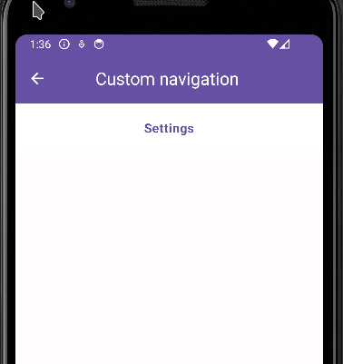
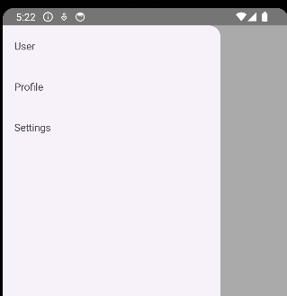
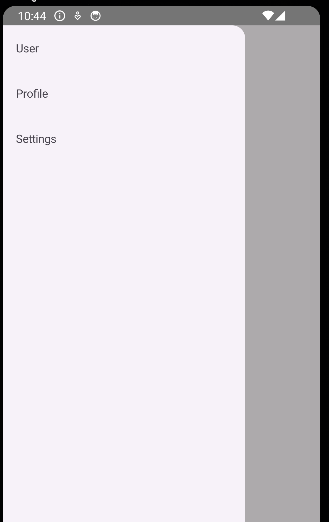
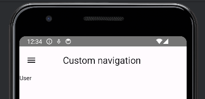
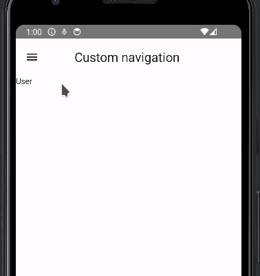

For small app's sometimes is better to write a custom navigation instead of using the oficial navigation library.

This guide helps you achieve three essential functions:

- A navigation drawer: this is the left menu that appears when you swipe your app.

- A scaffold: this is the basic structure of your app which contains top and bottom bar

- Keep track of current and previous screen: we are going to add the events to change the current screen and keep track the previous screen

**Navigation drawer**

First lets create an object to keep the identifier of the screens

```kotlin
object Screens {
    val ProfileScreen = "ProfileScreen"
    val SettingsScreen = "SettingScreen"
    val UserScreen = "UserScreen"
}
```

We want a function that returns the name of the screen

```kotlin
fun screenName(screen: String): String {
    return when (screen) {
        Screens.ProfileScreen -> "Profile"
        Screens.SettingsScreen -> "Settings"
        Screens.UserScreen -> "User"
        else -> ""
    }
}
```

With this composable we create the drawer item

```kotlin
@OptIn(ExperimentalMaterial3Api::class)
@Composable
fun DrawerItem(screen: String) {
    NavigationDrawerItem(

        label = { Text(screenName(screen)) },
        onClick = {

        },
        selected = false
    )
}
```

Then we are going to create the drawer and we add each drawer item to the drawer

```kotlin
@OptIn(ExperimentalMaterial3Api::class)
@Composable
fun NavigationDrawer() {
    val drawerState = rememberDrawerState(initialValue = DrawerValue.Open)
    ModalNavigationDrawer(
        drawerState = drawerState,
        drawerContent = {
            ModalDrawerSheet(modifier = Modifier.requiredWidth(300.dp)) {
            
                DrawerItem(Screens.UserScreen)
                DrawerItem(Screens.ProfileScreen)
                DrawerItem(Screens.SettingsScreen)
                
            }
        },
    ) {
        
    }
}
```

Looks like this



**Scaffold**

Lets create our screens and a main screen.

```kotlin
@Composable
fun ProfileScreen() {
    Text(screenName(Screens.ProfileScreen))
}

@Composable
fun SettingsScreen() {
    Text(screenName(Screens.SettingsScreen))
}

@Composable
fun UserScreen() {
    Text(screenName(Screens.UserScreen))
}
```

Our main screen will be very simple. It will display the current screen.

```kotlin
@Composable
fun MainScreen(currentScreen: String) {
    if (currentScreen == Screens.ProfileScreen) {
        ProfileScreen()
        return
    }

    if (currentScreen == Screens.SettingsScreen) {
        SettingsScreen()
        return
    }
    
    if (currentScreen == Screens.UserScreen) {
        UserScreen()
        return
    }
}
```

We add the main screen to the scaffold an we add a variable state to keep track of the current screen.

```kotlin
@OptIn(ExperimentalMaterial3Api::class)
@Preview
@Composable
fun NavigationScaffold() {
    val currentScreen by remember { mutableStateOf(Screens.UserScreen)}

    Scaffold(
    ) { innerPadding ->
        Column(
            modifier = Modifier.padding(innerPadding)
        ) {
            // Here is the main screen
            MainScreen(currentScreen)
        }
    }
}
```

Now we are going to add the drawer and the Scaffold. First lets add a parameter in the drawer to pass the scaffold.

```kotlin
fun NavigationDrawer(scaffoldContent:@Composable () -> Unit){
  // Ommited
}
```

And we call it inside of the drawer content

```kotlin
@OptIn(ExperimentalMaterial3Api::class)
@Composable
fun NavigationDrawer(scaffoldContent: () -> Unit) {
    val drawerState = rememberDrawerState(initialValue = DrawerValue.Open)
    ModalNavigationDrawer(
        drawerState = drawerState,
        drawerContent = {
            ModalDrawerSheet(modifier = Modifier.requiredWidth(300.dp)) {
                DrawerItem(Screens.UserScreen)
                DrawerItem(Screens.ProfileScreen)
                DrawerItem(Screens.SettingsScreen)
            }
        },
    ) {
        // Here is the scaffold
        scaffoldContent()
    }
}
```

It looks like this until now


**Keep track of current and previous screen**

Lets add the event when the drawer item is clicked. First we add the click event on the DrawerItem

```kotlin
fun DrawerItem(screen: String, onClick: () -> Unit) {
  // Ommited
}
```

```kotlin
@OptIn(ExperimentalMaterial3Api::class)
@Composable
fun DrawerItem(screen: String, onClick: () -> Unit) {
    NavigationDrawerItem(

        label = { Text(screenName(screen)) },
        onClick = {
            // Click event
            onClick()
        },
        selected = false
    )
}
```

Then we add a screen changed event in the NavigationDrawer

```kotlin
@OptIn(ExperimentalMaterial3Api::class)
@Composable
fun NavigationDrawer(
    scaffoldContent: @Composable () -> Unit,
    onScreenChanged: (String) -> Unit
) {
  // Ommited
}
```

```kotlin
@OptIn(ExperimentalMaterial3Api::class)
@Composable
fun NavigationDrawer(
    scaffoldContent: @Composable () -> Unit,
    onScreenChanged: (String) -> Unit
) {
    val drawerState = rememberDrawerState(initialValue = DrawerValue.Open)
    val scope = rememberCoroutineScope()

    ModalNavigationDrawer(
        drawerState = drawerState,
        drawerContent = {
            ModalDrawerSheet(modifier = Modifier.requiredWidth(300.dp)) {

                // OnScreenChanged events
                DrawerItem(
                    screen = Screens.UserScreen,
                    onClick = {
                        onScreenChanged(Screens.UserScreen)
                        scope.launch { drawerState.close() }
                    }

                )
                DrawerItem(
                    Screens.ProfileScreen,
                    onClick = {
                        onScreenChanged(Screens.ProfileScreen)
                        scope.launch { drawerState.close() }
                    }
                )
                DrawerItem(
                    Screens.SettingsScreen,
                    onClick = {
                        onScreenChanged(Screens.SettingsScreen)
                        scope.launch { drawerState.close() }
                    }
                )
            }
        },
    ) {
        scaffoldContent()
    }
}
```

And we use the event like this:

```kotlin
@OptIn(ExperimentalMaterial3Api::class)
@Composable
fun BasicCustomNavigation() {
    var currentScreen by remember { mutableStateOf(Screens.UserScreen) }

    NavigationDrawer(
        scaffoldContent = {
            NavigationScaffold(currentScreen)
        },
        onScreenChanged = {
            currentScreen = it
        }

    )
}
```



Now lets add the functionality to go to previous screen. First we are going to create a top bar:

1. By default the top bar will show a button to open the menu (drawer)

3. If there is a previous page the top bar will show a button to go back

Lets create the open menu button and the go back button

```kotlin
@Composable
fun GoBackButton (onClick: () -> Unit) {
    IconButton(onClick = { onClick() }) {
        Icon(
            imageVector = Icons.Filled.ArrowBack,
            contentDescription = "Back",
        )
    }
}

@Composable
fun OpenMenuButton(onClick: () -> Unit) {
    IconButton(onClick = { onClick() }) {
        Icon(
            imageVector = Icons.Filled.Menu,
            contentDescription = "Menu",
        )
    }
}
```

And we add the buttons in the top bar

```kotlin
@OptIn(ExperimentalMaterial3Api::class)
@Composable
fun TopBar(
    showPreviousButton: Boolean,
    onBackPressed: () -> Unit,
    onOpenDrawerPressed: () -> Unit
) {
    CenterAlignedTopAppBar(
        title = { Text("Custom navigation ") },
        navigationIcon = {
            if (showPreviousButton) {
                GoBackButton(onClick = { onBackPressed() })
            } else {
                OpenMenuButton (onClick = { onOpenDrawerPressed() })
            }
        }
    )
}
```



Now lets add the top bar and implement the open menu and go back events

```kotlin
@OptIn(ExperimentalMaterial3Api::class)
@Composable
fun NavigationScaffold(
    currentScreen: String,
    previousScreen: String,
    onBackPressed: () -> Unit,
    onOpenDrawerPressed: () -> Unit
) {
    Scaffold(
        // Here is the top bar
        topBar = {
            TopBar(
                showPreviousButton = previousScreen.isNotEmpty(),
                onBackPressed = { onBackPressed() },
                onOpenDrawerPressed = { onOpenDrawerPressed()}
            )
        }

    ) { innerPadding ->
        Column(
            modifier = Modifier.padding(innerPadding)
        ) {
            MainScreen(currentScreen)
        }
    }
}
```

And this is our main composable

```kotlin
@OptIn(ExperimentalMaterial3Api::class)
@Composable
@Preview
fun BasicCustomNavigation() {
    val scope = rememberCoroutineScope()
    val drawerState = rememberDrawerState(initialValue = DrawerValue.Closed)
    var currentScreen by remember { mutableStateOf(Screens.UserScreen) }
    var previousScreen by remember { mutableStateOf("") }

    NavigationDrawer(
        drawerState = drawerState,
        scaffoldContent = {
            NavigationScaffold(
                currentScreen = currentScreen,
                previousScreen = previousScreen,
                onBackPressed = {
                    currentScreen = previousScreen
                    previousScreen = ""
                },
                onOpenDrawerPressed = {
                    scope.launch { drawerState.open() }
                }
            )
        },
        onScreenChanged = {
            previousScreen = currentScreen
            currentScreen = it

        }
    )
}
```



I added some colors and this is the result


This is the final code

```kotlin

class MainActivity : ComponentActivity() {
    override fun onCreate(savedInstanceState: Bundle?) {
        super.onCreate(savedInstanceState)
        setContent {
            BasicCustomNavigationTheme {
                // A surface container using the 'background' color from the theme
                Surface(
                    modifier = Modifier.fillMaxSize(),
                    color = MaterialTheme.colorScheme.background
                ) {
                    BasicCustomNavigation()

                }
            }
        }
    }
}

object Screens {
    val ProfileScreen = "ProfileScreen"
    val SettingsScreen = "SettingScreen"
    val UserScreen = "UserScreen"
}

fun screenName(screen: String): String {
    return when (screen) {
        Screens.ProfileScreen -> "Profile"
        Screens.SettingsScreen -> "Settings"
        Screens.UserScreen -> "User"
        else -> ""
    }
}

@Composable
fun Screen(title: String) {
    Column(
        modifier = Modifier
            .background(color = MaterialTheme.colorScheme.onPrimary)
            .padding(20.dp)
            .fillMaxWidth(),
        horizontalAlignment = Alignment.CenterHorizontally

    ) {
        Text(
            text = title,
            fontWeight = FontWeight.Bold,
            color = MaterialTheme.colorScheme.primary
        )
    }
}

@Composable
fun ProfileScreen() {
    Screen(screenName(Screens.ProfileScreen))
}

@Composable
fun SettingsScreen() {
    Screen(screenName(Screens.SettingsScreen))
}

@Composable
fun UserScreen() {
    Screen(screenName(Screens.UserScreen))
}

@Composable
fun MainScreen(currentScreen: String) {
    if (currentScreen == Screens.ProfileScreen) {
        ProfileScreen()
        return
    }

    if (currentScreen == Screens.SettingsScreen) {
        SettingsScreen()
        return
    }

    if (currentScreen == Screens.UserScreen) {
        UserScreen()
        return
    }
}

@OptIn(ExperimentalMaterial3Api::class)
@Composable
@Preview
fun BasicCustomNavigation() {
    val scope = rememberCoroutineScope()
    val drawerState = rememberDrawerState(initialValue = DrawerValue.Closed)
    var currentScreen by remember { mutableStateOf(Screens.UserScreen) }
    var previousScreen by remember { mutableStateOf("") }

    NavigationDrawer(
        drawerState = drawerState,
        scaffoldContent = {
            NavigationScaffold(
                currentScreen = currentScreen,
                previousScreen = previousScreen,
                onBackPressed = {
                    currentScreen = previousScreen
                    previousScreen = ""
                },
                onOpenDrawerPressed = {
                    scope.launch { drawerState.open() }
                }
            )
        },
        onScreenChanged = {
            previousScreen = currentScreen
            currentScreen = it

        }
    )
}

@Composable
fun GoBackButton(onClick: () -> Unit) {
    IconButton(onClick = { onClick() }) {
        Icon(
            imageVector = Icons.Filled.ArrowBack,
            contentDescription = "Back",
            tint = MaterialTheme.colorScheme.onPrimary
        )
    }
}

@Composable
fun OpenMenuButton(onClick: () -> Unit) {
    IconButton(onClick = { onClick() }) {
        Icon(
            imageVector = Icons.Filled.Menu,
            contentDescription = "Menu",
            tint = MaterialTheme.colorScheme.onPrimary
        )
    }
}

@OptIn(ExperimentalMaterial3Api::class)
@Composable
fun TopBar(
    showPreviousButton: Boolean,
    onBackPressed: () -> Unit,
    onOpenDrawerPressed: () -> Unit
) {
    CenterAlignedTopAppBar(
        colors = TopAppBarDefaults.centerAlignedTopAppBarColors(
            containerColor = MaterialTheme.colorScheme.primary,
            titleContentColor = MaterialTheme.colorScheme.onPrimary,
        ),
        title = { Text("Custom navigation ") },
        navigationIcon = {
            if (showPreviousButton) {
                GoBackButton(onClick = { onBackPressed() })
            } else {
                OpenMenuButton(onClick = { onOpenDrawerPressed() })
            }

        }
    )
}

@OptIn(ExperimentalMaterial3Api::class)
@Composable
fun NavigationScaffold(
    currentScreen: String,
    previousScreen: String,
    onBackPressed: () -> Unit,
    onOpenDrawerPressed: () -> Unit
) {
    Scaffold(
        // Here is the top bar
        topBar = {
            TopBar(
                showPreviousButton = previousScreen.isNotEmpty(),
                onBackPressed = { onBackPressed() },
                onOpenDrawerPressed = { onOpenDrawerPressed() }
            )
        }

    ) { innerPadding ->
        Column(
            modifier = Modifier.padding(innerPadding)
        ) {
            MainScreen(currentScreen)
        }
    }
}

@OptIn(ExperimentalMaterial3Api::class)
@Composable
fun NavigationDrawer(
    drawerState: DrawerState,
    scaffoldContent: @Composable () -> Unit,
    onScreenChanged: (String) -> Unit
) {

    val scope = rememberCoroutineScope()

    ModalNavigationDrawer(
        drawerState = drawerState,
        drawerContent = {
            ModalDrawerSheet(modifier = Modifier.requiredWidth(300.dp)) {

                // OnScreenChanged events
                DrawerItem(
                    screen = Screens.UserScreen,
                    icon = {Icon(Icons.Default.AccountCircle, "User")}

                ) {
                    onScreenChanged(Screens.UserScreen)
                    scope.launch { drawerState.close() }
                }

                Divider()

                DrawerItem(
                    Screens.ProfileScreen,
                    icon = {Icon(Icons.Default.Face, "Profile")}
                ) {
                    onScreenChanged(Screens.ProfileScreen)
                    scope.launch { drawerState.close() }
                }

                Divider()

                DrawerItem(
                    Screens.SettingsScreen,
                    icon = {Icon(Icons.Default.Settings, "User")}
                ) {
                    onScreenChanged(Screens.SettingsScreen)
                    scope.launch { drawerState.close() }
                }
                Divider()
            }
        },
    ) {
        scaffoldContent()
    }
}

@OptIn(ExperimentalMaterial3Api::class)
@Composable
fun DrawerItem(screen: String, icon: @Composable () -> Unit, onClick: () -> Unit) {
    NavigationDrawerItem(

        label = { Text(screenName(screen)) },
        onClick = {
            // Click event
            onClick()
        },
        icon = { icon() },
        selected = false
    )
}
```
