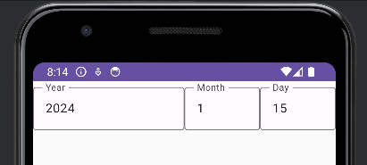
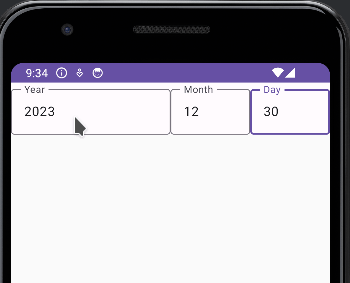
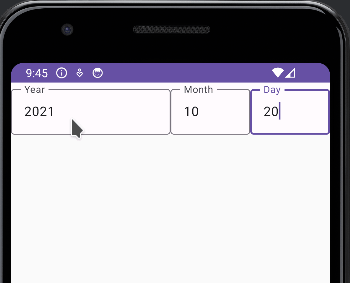

We want a basic composable that allows the user to capture: year, month and day of a date.

Our DateField will have two parameters: the value and the changed event

```kotlin
fun CustomDateField(
    value: LocalDate,
    onValueChanged: (LocalDate) -> Unit
) {
}
```

Now we are going to use a Row to place three text fields

```csharp
@OptIn(ExperimentalMaterial3Api::class)
@Composable
fun CustomDateField(
    value: LocalDate,
    onValueChanged: (LocalDate) -> Unit
) {

    Row() {
        OutlinedTextField(
            label = { Text("Year")},
            modifier = Modifier.fillMaxWidth(0.5f),
            value = value.year.toString(),
            onValueChange = {

            }
        )

        OutlinedTextField(
            label = { Text("Month")},
            modifier = Modifier.fillMaxWidth(0.5f),
            value = value.monthValue.toString(),
            onValueChange = {

            }
        )

        OutlinedTextField(
            label = { Text("Day")},
            modifier = Modifier.fillMaxWidth(1f),
            value = value.dayOfMonth.toString(),
            onValueChange = {
    
            }
        )
    }
}
```

Lets create a preview to see how it looks like

```csharp
@Preview
@Composable
fun CustomDateField() {
    val date = remember { mutableStateOf(LocalDate.now()) }
    
    AppTheme {
        Surface {

            CustomDateField(
                value = date.value,
                onValueChanged = {
                    date.value = it
                })
        }
    }
}
```

Looks like this



Now lets implement de events when the date changes. We are going to use a function that returns null when the date is not valid, otherwise it will the return the date.

```csharp
fun toLocalDateOrNull(year: String, month: String, day: String): LocalDate? {
    if (!isInteger(year) ||
        !isInteger(month) ||
        !isInteger(day)
    ) {
        return null
    }

    try {
        return LocalDate.of(year.toInt(), month.toInt(), day.toInt())
    } catch (ex: DateTimeException) {
        return null
    }
}
```

And we are going to create some functions to change the date.

```kotlin
fun changeYearOrNull(year: String, currentDate: LocalDate): LocalDate? {
    return toLocalDateOrNull(
        year,
        currentDate.monthValue.toString(),
        currentDate.dayOfMonth.toString()
    )
}

fun changeMonthOrNull(month: String, currentDate: LocalDate): LocalDate? {
    return toLocalDateOrNull(
        currentDate.year.toString(),
        month,
        currentDate.dayOfMonth.toString()
    )
}

fun changeDayOrNUll(day: String, currentDate: LocalDate): LocalDate? {
    return toLocalDateOrNull(
        currentDate.year.toString(),
        currentDate.monthValue.toString(),
        day
    )
}
```

And we implement each event

```kotlin

@OptIn(ExperimentalMaterial3Api::class)
@Composable
fun CustomDateField(
    value: LocalDate,
    onValueChanged: (LocalDate) -> Unit
) {

    Row() {
        OutlinedTextField(
            label = { Text("Year") },
            modifier = Modifier.fillMaxWidth(0.5f),
            value = value.year.toString(),
            onValueChange = {
                // Change year
                val newDate = changeYearOrNull(it, value)
                if (newDate != null) {
                    onValueChanged(newDate)
                }
            }
        )

        OutlinedTextField(
            label = { Text("Month") },
            modifier = Modifier.fillMaxWidth(0.5f),
            value = value.monthValue.toString(),
            onValueChange = {
                // Change month
                val newDate = changeMonthOrNull(it, value)
                if (newDate != null) {
                    onValueChanged(newDate)
                }
            }
        )

        OutlinedTextField(
            label = { Text("Day") },
            modifier = Modifier.fillMaxWidth(1f),
            value = value.dayOfMonth.toString(),
            onValueChange = {
                // Change Day
                val newDate = changeDayOrNUll(it, value)
                if (newDate != null) {
                    onValueChanged(newDate)
                }
            }
        )
    }
}
```

To facilitate that the user type the date, we are going to select the values when the field has focus. We add an state to control the selection

```kotlin
 val selectionYear = remember { mutableStateOf(TextRange(0, 0)) }
```

And we add the modifier with onFocusChanged event

```kotlin
OutlinedTextField(
  label = { Text("Year") },
  modifier = Modifier
      .fillMaxWidth(0.5f)
      .onFocusChanged {
          if (it.hasFocus) {
              scope.launch {
                  selectionYear.value = TextRange(0, value.toString().length)
              }
          }
      },
      
      // Ommited
)
```

We do the same for month and day fields. It looks like this:



Finally we are going to change the colors when the user type a wrong date. We add a variable state for the error.

```kotlin
val isError = remember { mutableStateOf(false)}
```

We change the error value when in the onValueChange event

```kotlin
 OutlinedTextField(
         // Parameters omitted
   
   onValueChange = {

          val newDate = changeYearOrNull(it.text, value)

          // There is an error
          isError.value = newDate == null
          
          if (newDate != null) {
              selectionYear.value = it.selection
              onValueChanged(newDate)
          }
      }
  )
```



This is the final code

```kotlin
import android.os.Bundle
import android.util.Log
import androidx.activity.ComponentActivity
import androidx.activity.compose.setContent
import androidx.compose.foundation.layout.Row
import androidx.compose.foundation.layout.fillMaxSize
import androidx.compose.foundation.layout.fillMaxWidth
import androidx.compose.material3.ExperimentalMaterial3Api
import androidx.compose.material3.MaterialTheme
import androidx.compose.material3.OutlinedTextField
import androidx.compose.material3.Surface
import androidx.compose.material3.Text
import androidx.compose.runtime.Composable
import androidx.compose.runtime.mutableStateOf
import androidx.compose.runtime.remember
import androidx.compose.runtime.rememberCoroutineScope
import androidx.compose.ui.Modifier
import androidx.compose.ui.focus.onFocusChanged
import androidx.compose.ui.text.TextRange
import androidx.compose.ui.text.input.TextFieldValue
import androidx.compose.ui.tooling.preview.Preview
import com.thisisthetime.customdatefield.ui.theme.AppTheme
import kotlinx.coroutines.launch
import java.time.DateTimeException
import java.time.LocalDate

class MainActivity : ComponentActivity() {
    override fun onCreate(savedInstanceState: Bundle?) {
        super.onCreate(savedInstanceState)
        setContent {
            AppTheme {
                // A surface container using the 'background' color from the theme
                Surface(
                    modifier = Modifier.fillMaxSize(),
                    color = MaterialTheme.colorScheme.background
                ) {

                }
            }
        }
    }
}

fun isInteger(number: String): Boolean {
    return number.toIntOrNull() != null
}

fun toLocalDateOrNull(year: String, month: String, day: String): LocalDate? {
    if (!isInteger(year) ||
        !isInteger(month) ||
        !isInteger(day)
    ) {
        return null
    }

    try {
        return LocalDate.of(year.toInt(), month.toInt(), day.toInt())
    } catch (ex: DateTimeException) {
        return null
    }
}

fun changeYearOrNull(year: String, currentDate: LocalDate): LocalDate? {
    return toLocalDateOrNull(
        year,
        currentDate.monthValue.toString(),
        currentDate.dayOfMonth.toString()
    )
}

fun changeMonthOrNull(month: String, currentDate: LocalDate): LocalDate? {
    return toLocalDateOrNull(
        currentDate.year.toString(),
        month,
        currentDate.dayOfMonth.toString()
    )
}

fun changeDayOrNUll(day: String, currentDate: LocalDate): LocalDate? {
    return toLocalDateOrNull(
        currentDate.year.toString(),
        currentDate.monthValue.toString(),
        day
    )
}

@OptIn(ExperimentalMaterial3Api::class)
@Composable
fun CustomDateField(
    value: LocalDate,
    onValueChanged: (LocalDate) -> Unit
) {
    val selectionYear = remember { mutableStateOf(TextRange(0, 0)) }
    val selectionMonth = remember { mutableStateOf(TextRange(0, 0)) }
    val selectionDay = remember { mutableStateOf(TextRange(0, 0)) }
    val scope = rememberCoroutineScope()

    val isError = remember { mutableStateOf(false)}

    Row() {
        OutlinedTextField(
            isError = isError.value,
            label = { Text("Year") },
            modifier = Modifier
                .fillMaxWidth(0.5f)
                .onFocusChanged {
                    if (it.hasFocus) {
                        scope.launch {
                            selectionYear.value = TextRange(0, value.year.toString().length)
                        }
                    }
                },
            value = TextFieldValue(text = value.year.toString(), selection = selectionYear.value),
            onValueChange = {
                val newDate = changeYearOrNull(it.text, value)
                isError.value = newDate == null
                if (newDate != null) {
                    selectionYear.value = it.selection
                    onValueChanged(newDate)
                }
            }
        )

        OutlinedTextField(
            isError = isError.value,
            label = { Text("Month") },
            modifier = Modifier.fillMaxWidth(0.5f)
                .onFocusChanged {
                    if (it.hasFocus) {
                        scope.launch {
                            selectionMonth.value = TextRange(0, value.monthValue.toString().length)
                        }
                    }
                },
            value = TextFieldValue(text = value.monthValue.toString(), selection = selectionMonth.value),
            onValueChange = {
                // Change month
                val newDate = changeMonthOrNull(it.text, value)
                isError.value = newDate == null
                if (newDate != null) {
                    selectionMonth.value = it.selection
                    onValueChanged(newDate)
                }
            }
        )

        OutlinedTextField(
            isError = isError.value,
            label = { Text("Day") },
            modifier = Modifier.fillMaxWidth(1f)
                .onFocusChanged {
                    if (it.hasFocus) {
                        scope.launch {
                            selectionDay.value = TextRange(0, value.dayOfMonth.toString().length)
                        }
                    }
                },
            value =TextFieldValue(text = value.dayOfMonth.toString(), selection = selectionDay.value),
            onValueChange = {
                val newDate = changeDayOrNUll(it.text, value)
                isError.value = newDate == null
                if (newDate != null) {
                    selectionDay.value = it.selection
                    onValueChanged(newDate)
                }
            }
        )
    }
}

@Preview
@Composable
fun CustomDateField() {
    val date = remember { mutableStateOf(LocalDate.now()) }

    AppTheme {
        Surface {

            CustomDateField(
                value = date.value,
                onValueChanged = {
                    date.value = it
                })
        }
    }
}
```
