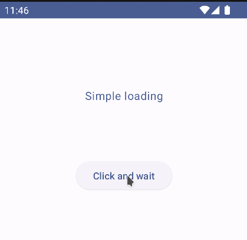
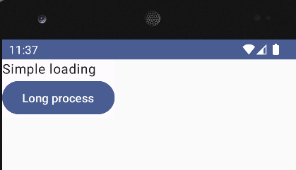

Crafting a loading indicator for your screens is a straightforward process. Achieve this in just four simple steps, requiring only a few minutes of your time.

1. Create the state

3. Create view model

5. Create the screen

7. Create a preview

You can watch how to code the screen in detail here:

https://www.youtube.com/watch?v=UIcMlH8EQYc

1\. Create de state

```kotlin
data class SimpleLoadingState(
    val loading: Boolean = false
)
```

2\. Create a view model with the long process

```kotlin
class SimpleLoadingViewModel : ViewModel() {
    private val _state = MutableStateFlow(SimpleLoadingState())
    val state: StateFlow<SimpleLoadingState> = _state

    fun longProcess() {
        _state.update { it.copy(loading = true) }
        val launch = viewModelScope.launch {
            delay(2000)
            _state.update { it.copy(loading = false) }
        }
    }
}
```

3\. Create the screen

```kotlin
@Composable
fun SimpleLoadingScreen(viewModel: SimpleLoadingViewModel) {
    val state by viewModel.state.collectAsState()
    Column {
        Text("Simple loading")

        if (state.loading) {
            CircularProgressIndicator()
        }

        Button(onClick = { viewModel.longProcess() }) {
            Text("Long process")
        }
    }
}
```

4\. Add a preview

```kotlin
// 4. Create a preview
@Preview
@Composable
fun SimpleLoadingPreview() {
    SimpleloadingTheme {
        Surface {
            SimpleLoadingScreen(SimpleLoadingViewModel())
        }
    }
}
```



Lets improve how it looks


This is the whole code

```kotlin

// 1. Create the state

data class SimpleLoadingState(
    val loading: Boolean = false
)

// 2. Create view model

class SimpleLoadingViewModel : ViewModel() {
    private val _state = MutableStateFlow(SimpleLoadingState())
    val state: StateFlow<SimpleLoadingState> = _state

    fun longProcess() {
        _state.update { it.copy(loading = true) }
        val launch = viewModelScope.launch {
            delay(2000)
            _state.update { it.copy(loading = false) }
        }
    }
}

// 3. Create the screen

@Composable
fun SimpleLoadingScreen(viewModel: SimpleLoadingViewModel) {
    val state by viewModel.state.collectAsState()
    Column(
        modifier = Modifier.fillMaxSize().padding(100.dp),
        horizontalAlignment = Alignment.CenterHorizontally
    ) {
        Text("Simple loading", color = MaterialTheme.colorScheme.primary)
        Spacer(modifier = Modifier.padding(20.dp))
        if (state.loading) {
            CircularProgressIndicator()
            Text("Wait...", color = MaterialTheme.colorScheme.primary)
        }
        Spacer(modifier = Modifier.padding(20.dp))
        ElevatedButton(onClick = { viewModel.longProcess() }) {
            Text("Click and wait")
        }
    }
}

// 4. Create a preview
@Preview
@Composable
fun SimpleLoadingPreview() {
    SimpleloadingTheme {
        Surface {
            SimpleLoadingScreen(SimpleLoadingViewModel())
        }
    }
}
```

- Github: [https://github.com/FractalCodeRicardo](https://github.com/FractalCodeRicardo)

- Medium: [https://medium.com/@nosilverbullet](https://medium.com/@nosilverbullet )

- Web page: [https://programmingheadache.com](https://programmingheadache.com )

- Source code: [https://github.com/FractalCodeRicardo/programmingheadache-misc/tree/main/simple-loading]( https://github.com/FractalCodeRicardo/programmingheadache-misc/tree/main/simple-loading)
