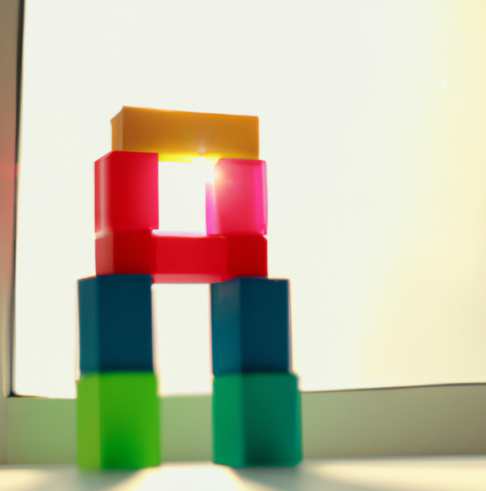

Programming is difficult. It's not just about having the technical and mental experience to solve problems through code, it also involves a certain psychological capacity to keep yourself motivated during long coding sessions.

Personally, one way to keep myself motivated and eager to keep writing a lot of code is by watching skilled programmers while they create code that blows my mind.

Here are some of my favorite channels featuring programmers from another world.

## The Coding Train

  
Daniel Shiffman is an amazing programmer and communicator. Currently, he creates content on his platform [https://thecodingtrain.com/](https://thecodingtrain.com/) and engages in programming challenges that can range from simple to very complex. Most of the time, his challenges use the p5.js library and involve physical simulations, fractals, natural phenomena, or simply abstract creations with a certain beauty.

As a viewer, you can follow along with his challenges and enjoy watching him code while wearing a big smile. You can also attempt the challenge yourself or work on it while watching the video.

Simply watching him program motivates you to enjoy coding.

https://www.youtube.com/watch?v=55iwMYv8tGI

https://www.youtube.com/watch?v=NJCiUVGiNyA

## Neal Wu

  
Neal Wu is a well-known programmer in competitive programming circles. He's a formidable machine when it comes to solving computing problems. Currently, he holds the top ranking on [https://leetcode.com/](https://leetcode.com/) and is part of the project [https://devinai.ai/](https://devinai.ai/).

When you watch his YouTube channel, you experience a mixture of anxiety and desire to improve as a programmer. You constantly find yourself questioning if he's truly human. After witnessing the speed at which he writes code, the first thing you'll feel is a strong urge to open your code editor.

https://www.youtube.com/watch?v=wh3pz18qC70

https://www.youtube.com/watch?v=YKpViLcTp64

## Bisqwit

  
Joel Yliluoma is a highly experienced programmer with fast typing skills. For all of us who have ever dreamed of being game developers, we love the retro gaming atmosphere in which his videos are immersed. Bisqwit isn't just a skilled programmer; he has a multifaceted personality that captivates you as you watch his videos. From one day to the next, he can be a musician, a bus driver, or a university professor, undoubtedly bringing his unique approach to learning and teaching, not just programming, but various fields. This sparks a strong desire to learn more.

https://www.youtube.com/watch?v=HQYsFshbkYw

https://www.youtube.com/watch?v=y71lli8MS8s

## Programming with Mosh

Mosh Hamedani is one of the finest educators on YouTube. The simplicity and clarity in his code make you feel that programming is an easy task if done well. Currently, he offers his courses on his platform [https://codewithmosh.com](https://codewithmosh.com/), and he is omnipresent on YouTube; we've all watched one of his videos when delving into a new programming language. Personally, I've found excellent advice on software architecture on his channel.

https://www.youtube.com/watch?v=W6NZfCO5SIk

https://www.youtube.com/watch?v=pTB0EiLXUC8

## The Art of Code

  
One of the topics that blows your mind as a programmer is fractal and shader programming, and Martijn Steinrucken excels at it. His profile is not only technical but also artistic and mathematical, and he's good at explaining his topics. It's impressive how he creates beautiful figures with just a few lines of code and makes it seem extremely easy. When I started watching this channel, I didn't understand much of what he was saying, but I enjoyed seeing the figures he created, which sparked a great curiosity to learn about new topics.

https://www.youtube.com/watch?v=l-07BXzNdPw

https://www.youtube.com/watch?v=1nDlYawrdqI

- Github: [https://github.com/FractalCodeRicardo](https://github.com/FractalCodeRicardo)

- Medium: [https://medium.com/@nosilverbullet](https://medium.com/@nosilverbullet )

- Web page: [https://programmingheadache.com](https://programmingheadache.com )

- Youtube: [https://www.youtube.com/@ProgrammingHeadache](https://www.youtube.com/@ProgrammingHeadache)
