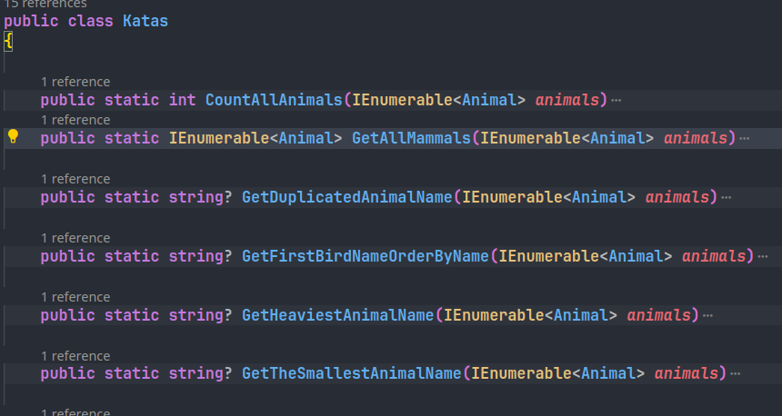
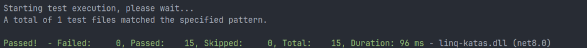

Do you want to test your skills as a C# programmer? Are you a beginner eager to learn more about programming problems and solutions? Or perhaps you're looking for a challenging way to sharpen your LINQ knowledge? Here is a set of C# LINQ katas designed to help you master the basics of LINQ and improve your programming skills. These katas will guide you through fundamental concepts and provide practical problems to solve, making them perfect for honing your abilities and deepening your understanding of LINQ in C#.


1. Just clone this repository

```
git clone https://github.com/FractalCodeRicardo/katas-linq.git
```

2\. You are provided with a class and a data list.

```
public record Animal(
    string Name = "",
    string Type = "",
    double Weight = 0.0,
    double Height = 0.0
);

public static IEnumerable<Animal> Get()
{
    var animals = new List<Animal>
    {
        new (Name: "Lion", Type: "Mammal", Weight: 190.0, Height: 3.5),
        new (Name: "Elephant", Type: "Mammal", Weight: 5000.0, Height: 10.0),
        new (Name: "Penguin", Type: "Bird", Weight: 1.5, Height: 0.5),
        new (Name: "Snake", Type: "Reptile", Weight: 10.0, Height: 1.0),
        new (Name: "Dolphin", Type: "Mammal", Weight: 300.0, Height: 2.0),
        new (Name: "Eagle", Type: "Bird", Weight: 5.0, Height: 0.8),
        new (Name: "Tiger", Type: "Mammal", Weight: 250.0, Height: 3.0),
        new (Name: "Crocodile", Type: "Reptile", Weight: 150.0, Height: 2.5),
        new (Name: "Giraffe", Type: "Mammal", Weight: 1200.0, Height: 5.5),
        new (Name: "Hawk", Type: "Bird", Weight: 2.0, Height: 0.6),
        // Duplicated hawk
        new (Name: "Hawk", Type: "Bird", Weight: 2.5, Height: 0.6)
    };

    return animals;
}
```

3\. Implement the methods in the Katas class



4\. Check you answers running

```
dotnet build
dotnet test
```



## Katas description

**CountAllAnimals**

Returns the total count of all animals in the given collection.

**GetAllMammals**

Retrieves all animals of type "Mammal" from the given collection.

**GetDuplicatedAnimalName**

Returns the name of any animal that appears more than once in the given collection. If no duplicates exist, returns `null`.

**GetFirstBirdNameOrderByName**

Retrieves the name of the first bird, ordered alphabetically by name, from the given collection.

**GetHeaviestAnimalName**

Returns the name of the heaviest animal in the given collection.

**GetTheSmallestAnimalName**

Returns the name of the smallest animal in terms of height in the given collection.

**GetAverageWeightOfReptiles**

Calculates and returns the average weight of all reptiles in the given collection.

**GetTotalWeightOfAllReptiles**

Calculates and returns the total weight of all reptiles in the given collection.

**GetAllReptileNames**

Retrieves the names of all reptiles in the given collection.

**GetTallestAnimalName**

Returns the name of the tallest animal in the given collection.

**GetNamesOfAnimalsHeavierThan**

Retrieves the names of all animals in the given collection that are heavier than a specified weight.

**GetCountOfEachAnimalType**

Returns a dictionary where the keys are animal types and the values are the counts of each type in the given collection.

**GetAllAnimalNamesWhichNameLengthIsFive**

Retrieves the names of all animals in the given collection whose name length is exactly five characters.

**GetTop3NamesOfAnimalsOrderedByWeightDescending**

Retrieves the names of the top 3 heaviest animals in the given collection, ordered by weight in descending order.

**GetBirdsNamesInDescendingOrder**

Retrieves the names of all birds in the given collection, ordered by name in descending order and separated by commas.

- Github: [https://github.com/FractalCodeRicardo](https://github.com/FractalCodeRicardo)

- Medium: [https://medium.com/@nosilverbullet](https://medium.com/@nosilverbullet )

- Web page: [https://programmingheadache.com](https://programmingheadache.com )

- Youtube: [https://www.youtube.com/@ProgrammingHeadache](https://www.youtube.com/@ProgrammingHeadache)
