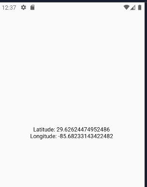

Integrating localization updates in Jetpack Compose is very easy. Follow these 5 steps to do it.


**1\. Setup your project**

Add permissions in manifest file

```
<?xml version="1.0" encoding="utf-8"?>
<manifest xmlns:android="http://schemas.android.com/apk/res/android"
    xmlns:tools="http://schemas.android.com/tools">
    
    <!-- Location permissions -->
    <uses-permission android:name="android.permission.ACCESS_COARSE_LOCATION" />
    <uses-permission android:name="android.permission.ACCESS_FINE_LOCATION" />
    <uses-permission android:name="android.permission.ACCESS_BACKGROUND_LOCATION" />
    <uses-permission android:name="android.permission.ACTIVITY_RECOGNITION" />
    <uses-permission
        android:name="com.google.android.gms.permission.ACTIVITY_RECOGNITION"
        android:maxSdkVersion="28" />
        
</manifest>
```

Add google dependency

In your build.gradle.kts add

```
dependencies {
    implementation(libs.play.services.location)
    
    //Ommited
}
```

In your libs.version.toml add

```
[versions]
playServicesLocation = "21.3.0"

[libraries]
play-services-location = { group = "com.google.android.gms", name = "play-services-location", version.ref = "playServicesLocation" }
```

**2\. Check for permission when your app start**

In the Main Activity add some functions to check and request permissions

```
class MainActivity : ComponentActivity() {

    private val LOCATION_PERMISSION_REQUEST_CODE = 1

    private fun checkPermissions() {

        if (!hasLocationPermissions()) {
            requestLocationPermissions()
            return
        }
    }

    private fun requestLocationPermissions() {
        ActivityCompat.requestPermissions(
            this,
            arrayOf(Manifest.permission.ACCESS_FINE_LOCATION),
            LOCATION_PERMISSION_REQUEST_CODE
        )
    }

    private fun hasLocationPermissions(): Boolean {
        return hasPermission(Manifest.permission.ACCESS_FINE_LOCATION) &&
                hasPermission(Manifest.permission.ACCESS_COARSE_LOCATION)
    }

    private fun hasPermission(permission: String): Boolean {
        val result = ActivityCompat.checkSelfPermission(this,permission);

        return result == PackageManager.PERMISSION_GRANTED;
    }
    
    //Ommited

}
```

And call checkPermissions on create

```
override fun onCreate(savedInstanceState: Bundle?) {
        super.onCreate(savedInstanceState)

        checkPermissions()
}
```

**3\. Create View Model And State**

State

```
data class LocationState(
    val latitude: Double = 0.0,
    val longitude: Double = 0.0
)
```

View model

```
class LocationViewModel: ViewModel() {
    private val uiState = MutableStateFlow(LocationState())
    val state: StateFlow<LocationState> = uiState;

    fun update(latitude: Double, longitude: Double) {
        uiState.update { it.copy(latitude, longitude) }
    }
}
```

**4\. Create Screen and add it to your activity**

Screen

```
@Composable
fun LocationScreen(viewModel: LocationViewModel) {
    val state by viewModel.state.collectAsState()

    Column(
        modifier = Modifier.fillMaxSize(),
        horizontalAlignment = Alignment.CenterHorizontally,
        verticalArrangement = Arrangement.Center,

        ) {
        Text(text = "Latitude: ${state.latitude}" )
        Text(text = "Longitude: ${state.longitude}")
    }
}
```

Add the screen as the content of your main activity

```
override fun onCreate(savedInstanceState: Bundle?) {
        super.onCreate(savedInstanceState)
        enableEdgeToEdge()

        checkPermissions()

        val viewModel = LocationViewModel()
        
        // Content added
        setContent {
           LocationScreen(viewModel)
        }
    }
```

**5\. Initialize the location client and update the view model**

```
class MainActivity : ComponentActivity() {

    private lateinit var locationClient: FusedLocationProviderClient
    
    @SuppressLint("MissingPermission")
    private fun initUpdates(viewModel: LocationViewModel) {
        locationClient = LocationServices.getFusedLocationProviderClient(this);

        locationClient.requestLocationUpdates(
            createLocationRequest(),
            {location -> viewModel.update(location.latitude, location.longitude)},
            Looper.getMainLooper()
        )
    }
    
    private fun createLocationRequest(): LocationRequest {
        return LocationRequest.Builder(1000).build()
    }
  
  //ommited

}
```

And finally call initUpdates on create method

```
override fun onCreate(savedInstanceState: Bundle?) {
        super.onCreate(savedInstanceState)
        enableEdgeToEdge()

        checkPermissions()

        val viewModel = LocationViewModel()
        
        // Here 
        initUpdates(viewModel)

        setContent {
           LocationScreen(viewModel)
        }
    }
```



This is the whole code

```
package com.example.locationintegration

import android.content.pm.PackageManager
import android.os.Bundle
import androidx.activity.ComponentActivity
import androidx.activity.compose.setContent
import androidx.activity.enableEdgeToEdge
import androidx.compose.foundation.layout.fillMaxSize
import androidx.compose.foundation.layout.padding
import androidx.compose.material3.Scaffold
import androidx.compose.material3.Text
import androidx.compose.runtime.Composable
import androidx.compose.ui.Modifier
import androidx.compose.ui.tooling.preview.Preview
import androidx.core.app.ActivityCompat
import com.example.locationintegration.ui.theme.LocationIntegrationTheme
import com.google.android.gms.location.LocationRequest
import android.Manifest
import android.annotation.SuppressLint
import android.os.Looper
import androidx.compose.foundation.layout.Arrangement
import androidx.compose.foundation.layout.Column
import androidx.compose.runtime.collectAsState
import androidx.compose.runtime.getValue
import androidx.compose.ui.Alignment
import androidx.lifecycle.ViewModel
import com.google.android.gms.location.FusedLocationProviderClient
import com.google.android.gms.location.LocationServices
import kotlinx.coroutines.flow.MutableStateFlow
import kotlinx.coroutines.flow.StateFlow
import kotlinx.coroutines.flow.update

class MainActivity : ComponentActivity() {

    private lateinit var locationClient: FusedLocationProviderClient

    @SuppressLint("MissingPermission")
    private fun initUpdates(viewModel: LocationViewModel) {
        locationClient = LocationServices.getFusedLocationProviderClient(this);

        locationClient.requestLocationUpdates(
            createLocationRequest(),
            {location -> viewModel.update(location.latitude, location.longitude)},
            Looper.getMainLooper()
        ).addOnFailureListener { ex -> {
            System.out.println(ex)
        } }

    }

    private val LOCATION_PERMISSION_REQUEST_CODE = 1

    private fun checkPermissions() {

        if (!hasLocationPermissions()) {
            requestLocationPermissions()
            return
        }
    }

    private fun requestLocationPermissions() {
        ActivityCompat.requestPermissions(
            this,
            arrayOf(Manifest.permission.ACCESS_FINE_LOCATION),
            LOCATION_PERMISSION_REQUEST_CODE
        )
    }

    private fun hasLocationPermissions(): Boolean {
        return hasPermission(Manifest.permission.ACCESS_FINE_LOCATION) &&
                hasPermission(Manifest.permission.ACCESS_COARSE_LOCATION)
    }

    private fun hasPermission(permission: String): Boolean {
        val result = ActivityCompat.checkSelfPermission(this,permission);

        return result == PackageManager.PERMISSION_GRANTED;
    }

    private fun createLocationRequest(): LocationRequest {
        return LocationRequest.Builder(1000).build()

    }

    override fun onCreate(savedInstanceState: Bundle?) {
        super.onCreate(savedInstanceState)
        enableEdgeToEdge()

        checkPermissions()

        val viewModel = LocationViewModel()

        initUpdates(viewModel)

        setContent {
           LocationScreen(viewModel)
        }
    }
}

@Composable
fun LocationScreen(viewModel: LocationViewModel) {
    val state by viewModel.state.collectAsState()

    Column(
        modifier = Modifier.fillMaxSize(),
        horizontalAlignment = Alignment.CenterHorizontally,
        verticalArrangement = Arrangement.Center,

        ) {
        Text(text = "Latitude: ${state.latitude}" )
        Text(text = "Longitude: ${state.longitude}")
    }
}

class LocationViewModel: ViewModel() {
    private val uiState = MutableStateFlow(LocationState())
    val state: StateFlow<LocationState> = uiState;

    fun update(latitude: Double, longitude: Double) {
        uiState.update { it.copy(latitude, longitude) }
    }
}

data class LocationState(
    val latitude: Double = 0.0,
    val longitude: Double = 0.0
)
```

You can check the project here

[https://github.com/FractalCodeRicardo/programmingheadache-misc/tree/main/location-integration](https://github.com/FractalCodeRicardo/programmingheadache-misc/tree/main/location-integration)

## Links

  
Github: [https://github.com/FractalCodeRicardo](https://github.com/FractalCodeRicardo)

Medium: [https://medium.com/@nosilverbullet](https://medium.com/@nosilverbullet )

Web page: [https://programmingheadache.com](https://programmingheadache.com )

Youtube: [https://www.youtube.com/@ProgrammingHeadache](https://www.youtube.com/@ProgrammingHeadache)
