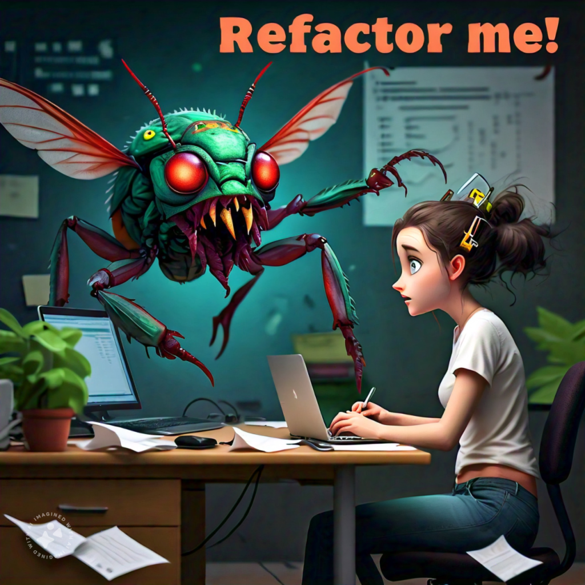

Refactoring is great; code that is a mess can gradually be transformed into code that is understandable at first glance.



_Refactoring is a controlled technique for improving the design of an existing code base. Its essence is applying a series of small behavior-preserving transformations, each of which "too small to be worth doing". However the cumulative effect of each of these transformations is quite significant. By doing them in small steps you reduce the risk of introducing errors. You also avoid having the system broken while you are carrying out the restructuring - which allows you to gradually refactor a system over an extended period of time._

**Martin Fowler**

One of the most commonly used and easiest refactors to implement is the Extract Method. In this refactor, a portion of code is replaced and placed in a new method with a well-defined purpose.

This refactor is so easy to apply and can be used in many situations that, without a doubt, its daily use greatly improves the quality of our code.

Let's see come practical examples that surely you will find in your daily programming.

## 1\. Extract large conditions into methods with descriptive names.

Consider this method that get costumers with discounts

```javascript
function customersWithPremiumDiscount(customers) {
    let customersWithDiscounts = [];

    customers.forEach(customer => {

        if (
            customer.age > 18 &&
            (customer.membership === 'Gold' || customer.membership === 'Platinum') &&
            customer.totalPurchases > 1000 &&
            !customer.hasPendingReturns
        ) {
            customersWithDiscounts.push(customer);
        }

    });

    return customersWithDiscounts;
}
```

We replace the condition for a method

```javascript
function HasDiscount(customer) {
    let isGoldOrPremium = customer.membership === 'Gold' 
        || customer.membership === 'Platinum';

    return customer.age > 18 &&
        isGoldOrPremium &&
        customer.totalPurchases > 1000 &&
        !customer.hasPendingReturns
}
```

And then we call that method

```javascript
function customersWithPremiumDiscount(customers) {
    return customers.filter(c => HasDiscount(c));
} //Look how clean the original function is!
```

## 2\. Extract methods to isolate calculations and improve code clarity

Consider this function to get the grand total of some sales

```javascript
function calculateTotal(sales) {

    let grandTotal = 0;

    for (let sale of sales) {
        var total = (sale.price * sale.quantity) + //subtotal
            (sale.price * sale.quantity) * sale.taxRate; // taxes

        grandTotal += total;
    }

    return grandTotal
}
```

We can extract the total calculation of each sale into a method

```javascript
function calculateTotal(sale) {
    var subtotal = sale.price * sale.quantity;
    var taxes = subtotal * sale.taxRate;
    var total = subtotal + taxes;

    return total;
}
```

And we change the original function. Looks awesome!

```javascript
function calculateTotalSales(sales) {
    return sales.reduce((a, i) => a + calculateTotal(i))
}
```

## 3\. Extract methods to eliminate duplicated code in object initialization

Consider this function to get some players.

```javascript
function getPlayers() {
    let player1 = {
        name: "Archer",
        class: "Ranger",
        health: Defaults.Health,
        mana: Defaults.Mana,
        level: Defaults.Leve
    };
    
    let player2 = {
        name: "Mage",
        class: "Wizard",
        health: Defaults.Health,
        mana: Defaults.Mana,
        level: Defaults.Leve
    };
    
    let player3 = {
        name: "Warrior",
        class: "Fighter",
        health: Defaults.Health,
        mana: Defaults.Mana,
        level: Defaults.Leve
    };

    return [player1, player2, player3]
}
```

We create a new method to eliminate the duplicated code

```javascript
function createPlayer(name, playerClass) {
    return {
        name: name,
        class: playerClass,
        health: Defaults.Health,
        mana: Defaults.Mana,
        level: Defaults.Leve
    };
}
```

And we use it in the original method. Great!

```javascript
function getPlayers() {
    return [
        createPlayer("Archer", "Ranger"),
        createPlayer("Mage", "Wizard"),
        createPlayer("Warrior", "Fighter")
    ]
}
```

## 4\. Extract similar loops into a method with appropriate parameters

Consider these similar loops

```javascript
function saveHighValueOrders(orders) {
    for (let order of orders) {
        if (order.amount > 500) {
            saveOrder(order);
        }
    }
}

function saveVipOrders(orders) {
    for (let order of orders) {
        if (order.customerType === "VIP") {
            saveOrder(order);
        }
    }
}

function saveExpeditedOrders(orders) {
    for (let order of orders) {
        if (order.isExpedited) {
            saveOrder(order);
        }
    }
}
```

As you see the only thing that changes is a condition. So we create a new method and we pass the condition as parameter.

```javascript
function saveOrders(orders, condition) {
    for (let order of orders) {
        if (condition(order)) {
            saveOrder(order);
        }
    }
}
```

The original functions are too much cleaner!

```javascript
function saveHighValueOrders(orders) {
    saveOrders(orders, order => order.amount > 500);
}

function saveVipOrders(orders) {
    saveOrders(orders, order => order.customerType === "VIP");
}

function saveExpeditedOrders(orders) {
    saveOrders(orders, order => order.isExpedited);
}
```

## Conclusions

What do you think? This refactor is so easy to apply, and the results are amazing!

## Links

  
Github: [https://github.com/FractalCodeRicardo](https://github.com/FractalCodeRicardo)

Medium: [https://medium.com/@nosilverbullet](https://medium.com/@nosilverbullet )

Web page: [https://programmingheadache.com](https://programmingheadache.com )

Youtube: [https://www.youtube.com/@ProgrammingHeadache](https://www.youtube.com/@ProgrammingHeadache)
