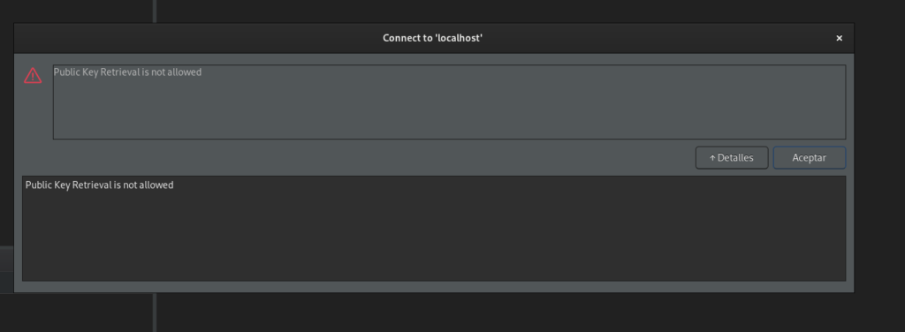
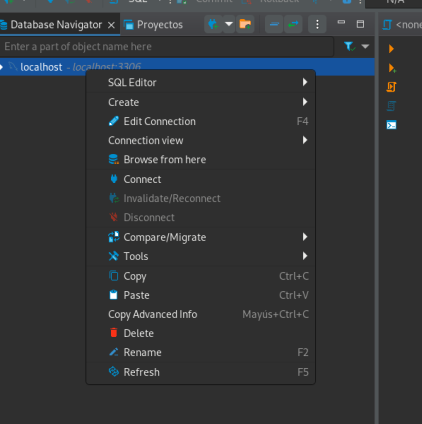
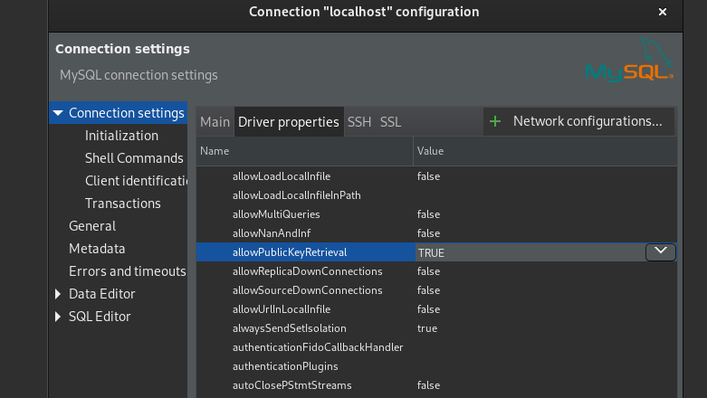
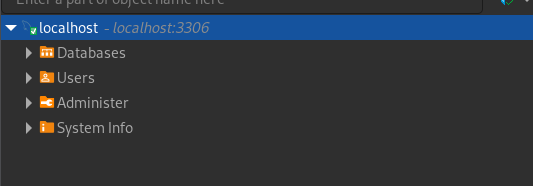

DBeaver is a powerful database tool that is frequently used for managing MySQL databases. One of the common errors in DBeaver is shown in the image

This error is easy to fix. Right click and Edit you connection

Then go to driver properties and set AllowPublicRetrieval to TRUE

Now the error is gone

