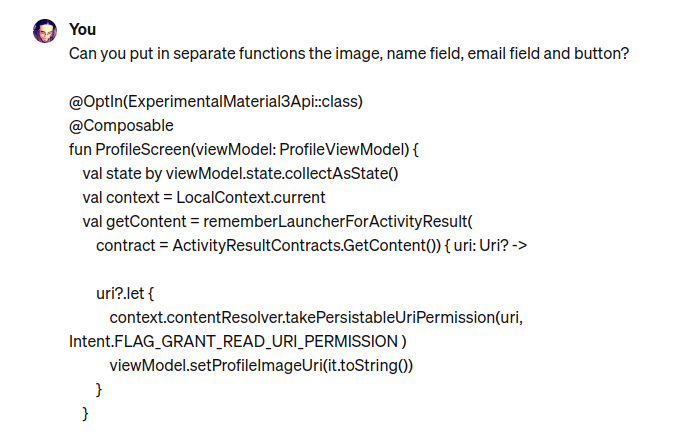
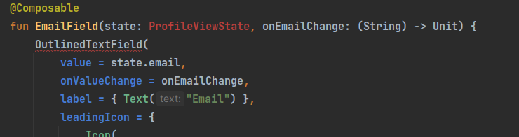
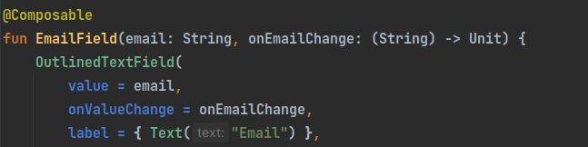

We want our composable screens cleaner and one way to achieve it is extracting our composable components in smaller functions. Consider the following example. I have a screen with three fields and I want to make it more readable.

```
@OptIn(ExperimentalMaterial3Api::class)
@Composable
fun ProfileScreen(viewModel: ProfileViewModel) {
    val state by viewModel.state.collectAsState()
    val context = LocalContext.current
    val getContent = rememberLauncherForActivityResult(
        contract = ActivityResultContracts.GetContent()) { uri: Uri? ->

        uri?.let {
            context.contentResolver.takePersistableUriPermission(uri, Intent.FLAG_GRANT_READ_URI_PERMISSION )
            viewModel.setProfileImageUri(it.toString())
        }
    }

    Column(
        modifier = Modifier
            .fillMaxSize()
            .padding(16.dp)
    ) {
        // Profile Image
        Box(
            modifier = Modifier
                .size(120.dp)
                .clip(CircleShape)
                .background(MaterialTheme.colorScheme.primary)
                .clickable {
                    getContent.launch("image/*") // Calls getContent
                },
            contentAlignment = Alignment.Center
        ) {
            if (state.image != null) {
                Image(
                    painter = rememberAsyncImagePainter(
                        model = state.image    // or ht
                    ),
                    contentDescription = null,
                    contentScale = ContentScale.Crop,
                    modifier = Modifier
                        .fillMaxSize()
                        .clip(CircleShape)
                )
            } else {
                Icon(
                    imageVector = Icons.Default.Upload,
                    contentDescription = null,
                    modifier = Modifier.size(48.dp),
                    tint = MaterialTheme.colorScheme.onPrimary
                )
            }
        }

        Spacer(modifier = Modifier.height(16.dp))

        // Name Field
        OutlinedTextField(
            value = state.name,
            onValueChange = {
                viewModel.setName(it)
            },
            label = { Text("Name") },
            leadingIcon = { Icon(imageVector = Icons.Default.Person, contentDescription = null) },
            modifier = Modifier
                .fillMaxWidth()
                .padding(8.dp)
        )

        Spacer(modifier = Modifier.height(16.dp))

        // Email Field
        OutlinedTextField(
            value = state.email, // Bind view Model
            onValueChange = {
                viewModel.setEmail(it)
            },
            label = { Text("Email") },
            leadingIcon = { Icon(
                imageVector = Icons.Default.MailOutline,
                contentDescription = null)
                          },
            modifier = Modifier
                .fillMaxWidth()
                .padding(8.dp)
        )

        Spacer(modifier = Modifier.height(16.dp))

        // Save Button
        Button(
            onClick = {
                viewModel.saveUserProfile()
            },
            modifier = Modifier
                .fillMaxWidth()
                .height(50.dp)
        ) {
            Icon(imageVector = Icons.Default.Done, contentDescription = null)
            Spacer(modifier = Modifier.width(8.dp))
            Text("Save")
        }
    }
}
```

So, I asked ChatGPT to put each field in separate functions  
  



Now the main screen is cleaner

```
@OptIn(ExperimentalMaterial3Api::class)
@Composable
fun ProfileScreen(viewModel: ProfileViewModel) {
    val state by viewModel.state.collectAsState()
    val context = LocalContext.current
    val getContent = rememberLauncherForActivityResult(
        contract = ActivityResultContracts.GetContent()
    ) { uri: Uri? ->

        uri?.let {
            context.contentResolver.takePersistableUriPermission(
                uri,
                Intent.FLAG_GRANT_READ_URI_PERMISSION
            )
            viewModel.setProfileImageUri(it.toString())
        }
    }

    Column(
        modifier = Modifier
            .fillMaxSize()
            .padding(16.dp)
    ) {
        // Image
        ProfileImageSection(state = state, onImageClick = { getContent.launch("image/*") })
        Spacer(modifier = Modifier.height(16.dp))
        
        // Name
        NameField(state = state, onNameChange = { viewModel.setName(it) })
        Spacer(modifier = Modifier.height(16.dp))
        
        // Email
        EmailField(state = state, onEmailChange = { viewModel.setEmail(it) })
        Spacer(modifier = Modifier.height(16.dp))
        
        SaveButton(onClick = { viewModel.saveUserProfile() })
    }
}
```

Of course, ChatGPT didn't do the whole job, we have to do our job too. In this case, ChatGPT leaves some errors like the following  



The fix is straightforward



Now our fields section is very clean

```
Column(
        modifier = Modifier
            .fillMaxSize()
            .padding(16.dp)
    ) {
        // Image
        ProfileImageSection(state.image, onImageClick = { getContent.launch("image/*") })
        Spacer(modifier = Modifier.height(16.dp))

        // Name
        NameField(state.name, onNameChange = { viewModel.setName(it) })
        Spacer(modifier = Modifier.height(16.dp))

        // Email
        EmailField(state.email, onEmailChange = { viewModel.setEmail(it) })
        Spacer(modifier = Modifier.height(16.dp))
        
        SaveButton(onClick = { viewModel.saveUserProfile() })
    }
```
