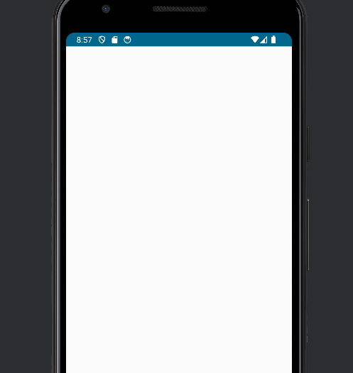
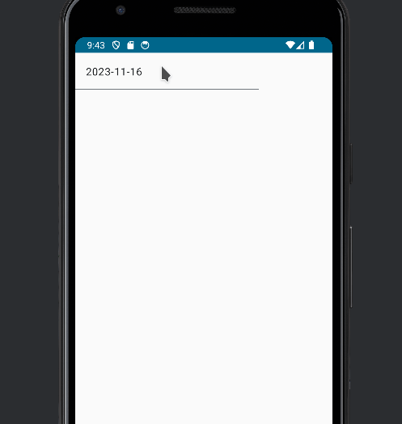

There are some options for handling dates in Jetpack Compose. Recently, I found a very straightforward library for this porpuse.

We need two things:

- A TextField in which we are going to show the date

- A Calendar picker that helps us to select the date

We are going to use the Calendar Picker in this github repo:

[https://github.com/maxkeppeler/sheets-compose-dialogs](https://github.com/maxkeppeler/sheets-compose-dialogs)

First, we put the dependencies of the Calendar library in the build.gradle.kts file

```
dependencies {

    implementation("com.maxkeppeler.sheets-compose-dialogs:core:1.2.0")
    implementation("com.maxkeppeler.sheets-compose-dialogs:calendar:1.2.0")
    
}
```

Next, lets create a new Composable and put the example given by the library

```
@OptIn(ExperimentalMaterial3Api::class)
@Composable
fun CustomDatePicker() {
    val selectedDate = remember { mutableStateOf(LocalDate.now())}

    CalendarDialog(
        state = rememberUseCaseState(visible = true, true, onCloseRequest = { } ),
        config = CalendarConfig(
            yearSelection = true,
            style = CalendarStyle.MONTH,
        ),
        selection = CalendarSelection.Date(
            selectedDate = selectedDate.value
        ) { newDate ->
            selectedDate.value = newDate
        },
    )
}
```

This is how the example looks like



Now, lets put a TextField to show the date

```
    TextField(
        value = selectedDate.value.format(DateTimeFormatter.ISO_DATE) ,
        onValueChange = {}
    )
```


Now, we need to add functionality to open the dialog. We want that the dialog opens when the TextField is clicked. So, we need a variable that handles the open state.

```
 val open = remember { mutableStateOf(false)}
```

And we add the clicked event

```
    TextField(
        modifier = Modifier.clickable { //Click event
            open.value = true
        },
        value = selectedDate.value.format(DateTimeFormatter.ISO_DATE) ,
        onValueChange = {}
    )
```

You will notice that the click event **does not work** you have to disable the TextField and modify the colors.

```
    TextField(
        modifier = Modifier.clickable { //Click event
            open.value = true
        },
        enabled = false,// <- Add this to make click event work
        value = selectedDate.value.format(DateTimeFormatter.ISO_DATE) ,
        onValueChange = {},
        colors = TextFieldDefaults.outlinedTextFieldColors(
            disabledTextColor = MaterialTheme.colorScheme.onSurface,
            disabledBorderColor = MaterialTheme.colorScheme.outline,
            disabledPlaceholderColor = MaterialTheme.colorScheme.onSurfaceVariant,
            disabledLabelColor = MaterialTheme.colorScheme.onSurfaceVariant,
            disabledLeadingIconColor = MaterialTheme.colorScheme.onSurfaceVariant,
            disabledTrailingIconColor = MaterialTheme.colorScheme.onSurfaceVariant)
    )
```

Finally, we display the dialog only when open state is true

```
    if (open.value) {
        CalendarDialog(
            state = rememberUseCaseState(visible = true, true, onCloseRequest = { } ),
            config = CalendarConfig(
                yearSelection = true,
                style = CalendarStyle.MONTH,
            ),
            selection = CalendarSelection.Date(
                selectedDate = selectedDate.value
            ) { newDate ->
                selectedDate.value = newDate
            },
        )
    }
```



Additionally, we are going to add the parameters to change the value from outside the composable

```
fun CustomDatePicker(
    value: LocalDate,
    onValueChange: (LocalDate) -> Unit
) 
```

We can use the Composable like this

```
@Preview
@Composable
fun CustomDatePickerPreview(){
    CustomdatepickerTheme {
        val date = remember { mutableStateOf(LocalDate.now())}
        CustomDatePicker(
            value = date.value,
            onValueChange = {date.value = it}
        )
    }
}
```

This is the whole code

```
import androidx.compose.foundation.clickable
import androidx.compose.material3.ExperimentalMaterial3Api
import androidx.compose.material3.MaterialTheme
import androidx.compose.material3.TextField
import androidx.compose.material3.TextFieldDefaults
import androidx.compose.runtime.Composable
import androidx.compose.runtime.mutableStateOf
import androidx.compose.runtime.remember
import androidx.compose.ui.Modifier
import androidx.compose.ui.tooling.preview.Preview
import com.maxkeppeker.sheets.core.models.base.rememberUseCaseState
import com.maxkeppeler.sheets.calendar.CalendarDialog
import com.maxkeppeler.sheets.calendar.models.CalendarConfig
import com.maxkeppeler.sheets.calendar.models.CalendarSelection
import com.maxkeppeler.sheets.calendar.models.CalendarStyle
import com.thisisthetime.customdatepicker.ui.theme.CustomdatepickerTheme
import java.time.LocalDate
import java.time.format.DateTimeFormatter

@OptIn(ExperimentalMaterial3Api::class)
@Composable
fun CustomDatePicker(
    value: LocalDate,
    onValueChange: (LocalDate) -> Unit
) {

    val open = remember { mutableStateOf(false)}

    if (open.value) {
        CalendarDialog(
            state = rememberUseCaseState(visible = true, true, onCloseRequest = { open.value = false } ),
            config = CalendarConfig(
                yearSelection = true,
                style = CalendarStyle.MONTH,
            ),
            selection = CalendarSelection.Date(
                selectedDate = value
            ) { newDate ->
                onValueChange(newDate)
            },
        )
    }

    TextField(
        modifier = Modifier.clickable { //Click event
            open.value = true
        },
        enabled = false,// <- Add this to make click event work
        value = value.format(DateTimeFormatter.ISO_DATE) ,
        onValueChange = {},
        colors = TextFieldDefaults.outlinedTextFieldColors(
            disabledTextColor = MaterialTheme.colorScheme.onSurface,
            disabledBorderColor = MaterialTheme.colorScheme.outline,
            disabledPlaceholderColor = MaterialTheme.colorScheme.onSurfaceVariant,
            disabledLabelColor = MaterialTheme.colorScheme.onSurfaceVariant,
            disabledLeadingIconColor = MaterialTheme.colorScheme.onSurfaceVariant,
            disabledTrailingIconColor = MaterialTheme.colorScheme.onSurfaceVariant)
    )
}

@Preview
@Composable
fun CustomDatePickerPreview(){
    CustomdatepickerTheme {
        val date = remember { mutableStateOf(LocalDate.now())}
        CustomDatePicker(
            value = date.value,
            onValueChange = {date.value = it}
        )
    }
}
```
