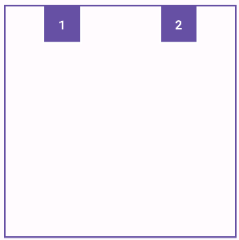

The basics for controlling how elements are showing in Compose consists in the use of _**Row**_ and _**Column**_. Here is the main idea of both:

- _**Row** will show the elements in a single row from left to right._

- _**Column** will show the elements in a single column from top to bottom._

Lets see the common cases. We will use this composable for the examples:

```
@Composable
fun Element(text: String) {
   Column(modifier = Modifier.background(MaterialTheme.colorScheme.primary)
       .border(border = BorderStroke(2.dp, MaterialTheme.colorScheme.onPrimary))
       .width(50.dp)
       .height(50.dp),
       verticalArrangement = Arrangement.Center,
       horizontalAlignment = Alignment.CenterHorizontally) {
       Text(
           text = text,
           color = MaterialTheme.colorScheme.onPrimary,
           fontWeight = FontWeight.Bold
       )
   }
}
```

**One row x Nth elements**


```
Row() {
    Element(text = "1")
    Element(text = "2")
    Element(text = ".")
    Element(text = ".")
    Element(text = "N")
}
```

**One column x Nth elements**


```
Column() {
    Element(text = "1")
    Element(text = "2")
    Element(text = ".")
    Element(text = ".")
    Element(text = "N")
}
```

**Nth Elements x Nth Elements**


```
Column() {
    Row() {
        Element(text = "1")
        Element(text = "2")
        Element(text = "3")
    }

    Row() {
        Element(text = "1")
        Element(text = "2")
        Element(text = "3")
    }

    Row() {
        Element(text = "1")
        Element(text = "2")
        Element(text = "3")
    }
}
```

**Nth Elements **in a Column** Centered**


Vertically


Horizontally


Full centered

```
Column(
    modifier = Modifier.fillMaxSize(),
    verticalArrangement = Arrangement.Center,
    horizontalAlignment = Alignment.CenterHorizontally
) {
    Element(text = "1")
    Element(text = "2")
    Element(text = ".")
    Element(text = "N")
}
```

**Nth Elements **in a Row** Centered**


Vertically


Horizontally


Full centered

```
Row(
        modifier = Modifier.fillMaxSize(),
        horizontalArrangement = Arrangement.Center,
        verticalAlignment = Alignment.CenterVertically
) {
    Element(text = "1")
    Element(text = "2")
    Element(text = ".")
    Element(text = "N")
}
```

**Other alignments in a Column** **(or Row)**


Start


Center


End

```
Column(
    modifier = Modifier.fillMaxSize(),
    // Uncomment the one you need
    //horizontalAlignment = Alignment.Start,
    //horizontalAlignment = Alignment.CenterHorizontally,
    horizontalAlignment = Alignment.End,
) {
    Element(text = "1")
    Element(text = "2")
}
```

**Other arragements in a Row (or Column)**


Space between



Space around (space after and before are the same)


Space evenly (all spaces are the same)

```
Row(
    modifier = Modifier.fillMaxSize(),
    // Uncomment the one that you needs
    //horizontalArrangement = Arrangement.SpaceBetween,
    //horizontalArrangement = Arrangement.SpaceAround,
    horizontalArrangement = Arrangement.SpaceEvenly,
) {
    Element(text = "1")
    Element(text = "2")
}
```

**Nested rows in columns**


```
Column() {
    Column {
        Element("C1")
        Element("C2")
    }

    Row() {
        Element("R1")
        Element("R2")
        Element("R3")
    }
    Row() {
        Element("R1")
        Element("R2")
        Element("R3")
    }

    Column {
        Element("C1")
        Element("C2")
        Element("C3")
    }
}
```

**Nested columns in rows**


```
Row() {
    Row {
        Element("R1")
        Element("R2")
    }

    Column() {
        Element("C1")
        Element("C2")
        Element("C3")
    }
    Column() {
        Element("C1")
        Element("C2")
        Element("C3")
    }

    Row {
        Element("R1")
        Element("R2")
    }
}
```

**Modifiers Width and Height**

You can set **height** and **width** with this methods of the Modifier class:

- To set fixed **height** use **_Modifier.height_** method

- To set fixed **width** use **_Modifier.width_** method

- To set **max width** use **_Modifier.fillMaxWidth_**

- To set **max height** use **_Modifier.fillMaxHeight_**

- To set **max width and height** use **_Modifier.fillMaxSize_**

- To set the width/height size **relative to parent** use _**Modifier.fillMaxWidth/Modifier.fillMaxHeight**_ using the **fraction parameter**.

Lets see some examples

**Rows width**


```
Column() {

    Row(modifier = Modifier.fillMaxWidth()) {
        ElementFillSize(text = "Max width")
    }

    Row(modifier = Modifier.width(200.dp)) {
        ElementFillSize(text = "200dp")
    }

    Row(modifier = Modifier.fillMaxWidth(0.5f)) {
        ElementFillSize(text = "50%")
    }
}
```

**Columns Height**


```
Row() {

    Column(modifier = Modifier.fillMaxHeight()) {
        ElementFillSize(text = "Max width")
    }

    Column(modifier = Modifier.height(200.dp)) {
        ElementFillSize(text = "200dp")
    }

    Column(modifier = Modifier.fillMaxHeight(0.5f)) {
        ElementFillSize(text = "50%")
    }
}
```
