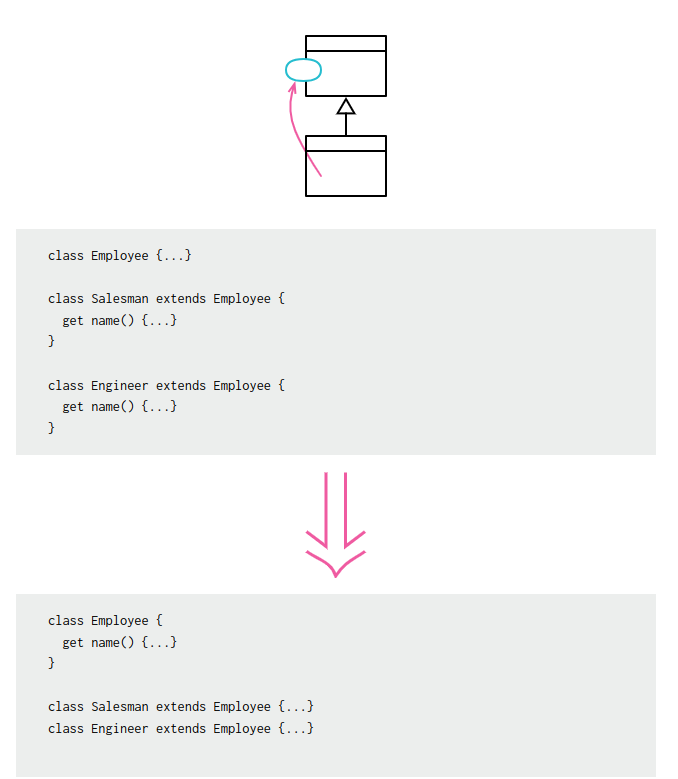
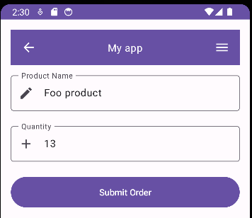
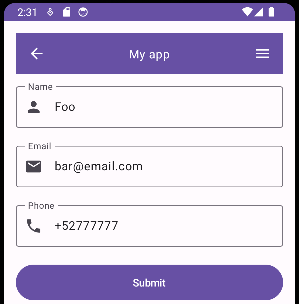

The pull-up refactoring involves finding common code and moving it to a parent class so that child classes can share it. This example is given in the book _Refactoring: Improving the Design of Existing Code_ by Martin Fowler.



Even though **composables are not classes**, the same principles can be applied to Jetpack Compose. We can think in putting common code in a **parent composable function instead of a class**.

Consider the following example with a Client and Order Screens



Order



Client

They both **share the header and the submit button**. The basic structure code of both is the following:

```
data class Client(
    val name: String = "",
    val email: String = "",
    val phone: String = ""
)

data class Order(
    val productName: String = "",
    val quantity: Int = 0
)

@OptIn(ExperimentalMaterial3Api::class)
@Composable
fun ClientScreen(client: Client) {
    Column(
        modifier = Modifier
            .fillMaxSize()
            .padding(16.dp)
    ) {

       // HEADER CODE
              
       // FORM CLIENT CODE
       
       // SUBMIT BUTTON
    }
}

@OptIn(ExperimentalMaterial3Api::class)
@Composable
fun OrderScreen(order: Order) {
    Column(
        modifier = Modifier
            .fillMaxSize()
            .padding(16.dp)
    ) {
       // HEADER CODE
              
       // FORM ORDER CODE
       
       // SUBMIT BUTTON
    }
}
```

Now lets create a new composable with the common code and we send the form content as a parameter.

```
@Composable
fun TemplateForm(
    onSubmit: () -> Unit,
    form: @Composable ()-> Unit
) {
    // HEADER CODE

    form()

    // SUBMIT CODE
}
```

And we use it like this:

```
@Composable()
private fun OrderScreen(order: Order) {
    TemplateForm(
        onSubmit = {}
    ) {
       // FORM CODE
    }
}

@Composable()
private fun ClientScreen(client: Client) {
    TemplateForm(
        onSubmit = {}
    ) {
        // FORM CODE
    }
}
```

This is the whole code:

```
@Composable
fun TemplateForm(
    onSubmit: () -> Unit,
    form: @Composable () -> Unit
) {
    Column(
        modifier = Modifier
            .fillMaxSize()
            .padding(16.dp)
    )  {
        Row(
            modifier = Modifier
                .fillMaxWidth()
                .height(56.dp)
                .background(MaterialTheme.colorScheme.primary)
                .padding(16.dp),
            horizontalArrangement = Arrangement.SpaceBetween,
            verticalAlignment = Alignment.CenterVertically
        ) {

            Icon(
                imageVector = Icons.Default.ArrowBack,
                contentDescription = null,
                modifier = Modifier
                    .clickable { }
                    .size(24.dp),
                tint = MaterialTheme.colorScheme.onPrimary

            )

            Text(
                text = "My app",
                color = MaterialTheme.colorScheme.onPrimary
            )

            Icon(
                imageVector = Icons.Default.Menu,
                contentDescription = null,
                modifier = Modifier
                    .clickable { }
                    .size(24.dp),
                tint = MaterialTheme.colorScheme.onPrimary
            )
        }

        form()

        Spacer(modifier = Modifier.height(16.dp))

        // Submit button
        Button(
            onClick = {
                onSubmit()
            },
            modifier = Modifier
                .fillMaxWidth()
                .height(48.dp)
        ) {
            Text("Submit")
        }
    }

}

@OptIn(ExperimentalMaterial3Api::class)
@Composable()
private fun OrderScreen(order: Order) {
    TemplateForm(
        onSubmit = {}
    ) {
        // Product Name field
        OutlinedTextField(
            value = order.productName,
            onValueChange = {  },
            label = { Text("Product Name") },
            leadingIcon = { Icon(imageVector = Icons.Default.Create, contentDescription = null) },
            modifier = Modifier
                .fillMaxWidth()
                .padding(vertical = 8.dp)
        )

        // Quantity field
        OutlinedTextField(
            value = order.quantity.toString(),
            onValueChange = {},
            label = { Text("Quantity") },
            leadingIcon = { Icon(imageVector = Icons.Default.Add, contentDescription = null) },
            modifier = Modifier
                .fillMaxWidth()
                .padding(vertical = 8.dp),
            keyboardOptions = KeyboardOptions.Default.copy(
                keyboardType = KeyboardType.Number,
                imeAction = ImeAction.Done
            ),
            keyboardActions = KeyboardActions(
                onDone = {
                 
                }
            )
        )
    }
}

@OptIn(ExperimentalMaterial3Api::class)
@Composable()
private fun ClientScreen(client: Client) {
    TemplateForm(
        onSubmit = {}
    ) {

        OutlinedTextField(
            value = client.name,
            onValueChange = { },
            label = { Text("Name") },
            leadingIcon = { Icon(imageVector = Icons.Default.Person, contentDescription = null) },
            modifier = Modifier
                .fillMaxWidth()
                .padding(vertical = 8.dp)
        )

       // Email field
        OutlinedTextField(
            value = client.email,
            onValueChange = { },
            label = { Text("Email") },
            leadingIcon = { Icon(imageVector = Icons.Default.Email, contentDescription = null) },
            modifier = Modifier
                .fillMaxWidth()
                .padding(vertical = 8.dp),
            keyboardOptions = KeyboardOptions.Default.copy(
                keyboardType = KeyboardType.Email,
                imeAction = ImeAction.Next
            ),
            keyboardActions = KeyboardActions(
                onNext = {
                   
                }
            )
        )

        OutlinedTextField(
            value = client.phone,
            onValueChange = { },
            label = { Text("Phone") },
            leadingIcon = { Icon(imageVector = Icons.Default.Phone, contentDescription = null) },
            modifier = Modifier
                .fillMaxWidth()
                .padding(vertical = 8.dp),
            keyboardOptions = KeyboardOptions.Default.copy(
                keyboardType = KeyboardType.Phone,
                imeAction = ImeAction.Done
            ),
            keyboardActions = KeyboardActions(
                onDone = {
                    
                }
            )
        )
    }
}

@Composable
@Preview
fun OrderFormScreenPreview() {
    PullUpRefactorTheme {
        Surface {
            OrderScreen(
                order = Order(
                    productName = "Foo product",
                    quantity = 13
                )
            )
        }
    }
}

@Composable
@Preview
fun ClientFormScreenPreview() {
    PullUpRefactorTheme {
        Surface {
            ClientScreen(
                Client(
                    name = "Foo",
                    email = "bar@email.com",
                    phone = "+52777777"
                )
            )
        }
    }
}
```
