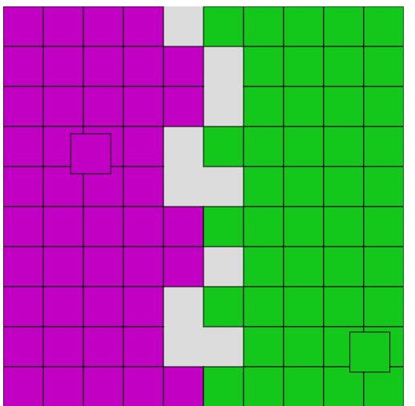
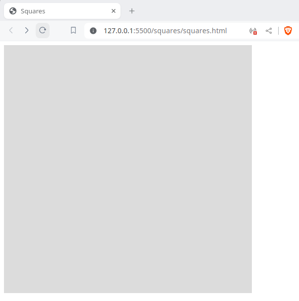
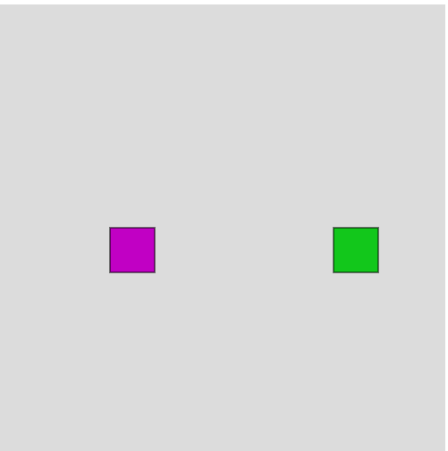
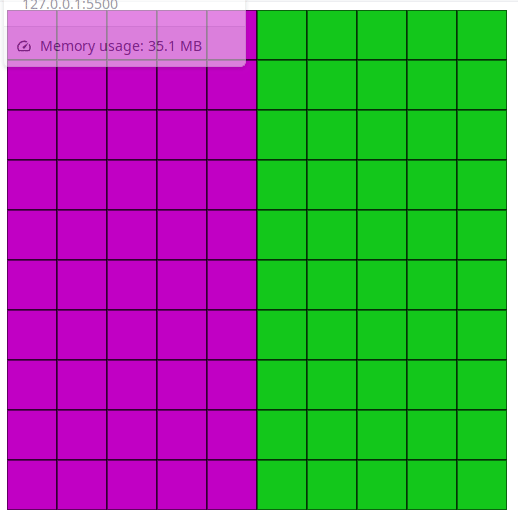

Step into the exciting world of interactive web simulations as we delve into the creation of a dynamic square simulation using the powerful p5.js library. In this comprehensive guide, we'll walk you through each crucial step to bring your simulation to life, from the initial setup to drawing the square, defining boundaries, enabling movement, and implementing collision detection.

Whether you're a seasoned developer looking to enhance your skills or a beginner eager to explore the vast possibilities of p5.js, this tutorial promises to be your go-to resource. Follow along as we demystify the process, providing clear insights and actionable steps that empower you to build an engaging square simulation effortlessly.

Unleash your creativity and master the art of web-based simulations with this step-by-step guide. Let's embark on this exciting journey together, combining the ease of p5.js with the thrill of creating a visually compelling and interactive square simulation. Ready to bring your ideas to life? Let's get started!

## Youtube video

You can watch the video where I was coding the simulation

https://www.youtube.com/watch?v=aLr-4GZGIDQ

## 1\. Setup

Create two files: squares.html and squares.js. In the html file add the reference to p5.js library and squares.js

```
<!DOCTYPE html>
<html lang="en">
<head>
    <meta charset="UTF-8">
    <meta name="viewport" content="width=device-width, initial-scale=1.0">
    <title>Squares</title>
    <script src="https://cdnjs.cloudflare.com/ajax/libs/p5.js/1.9.0/p5.min.js" integrity="sha512-uaz5GpnQoE6t5echKlX8P52czvsIGgLPcvlzfvRubLZ1Hp8JemUDnbUiAahbVtPb+jUVrNETuXvAhDDF/N3M4w==" crossorigin="anonymous" referrerpolicy="no-referrer"></script>
    <script src="squares.js"></script>
</head>
<body>
    
</body>
</html>
```

In the squares.js file add the get started code from the official P5 webpage [https://p5js.org/get-started/](https://p5js.org/get-started/)

```

const SIZE = 500;

function setup() {
  createCanvas(SIZE, SIZE);
}

function draw() {
  background(220);
}
```

Open the html file in a web browser, you will get this:  



## 2\. Draw the squares

To draw each square we need to set the X and Y coordinates in the canvas. We will use a special class for this:

```
class Vector {
    constructor(x, y) {
        this.x = x;
        this.y = y;
    }
}
```

We are going to use two special classes for the simulation. The class Simulation will have the Agents (squares) moving in the screen, and the Agent class will have the position and direction of each agent.

```

class Simulation {
    constructor() {
        this.square1 = new Agent(
            new Vector((1 / 4) * SIZE, SIZE / 2)
        )
        this.square2 = new Agent(
            new Vector((3 / 4) * SIZE, SIZE / 2)
        )
    }
}

class Agent {
    constructor(position) {
        this.position = position

        this.direction = new Vector(
            Math.random(),
            Math.random()
        )
    }
}
```

To draw the agents we will use the square and fill functions of p5.js. You can check the reference page [https://p5js.org/reference/](https://p5js.org/reference/)

```
const simulation = new Simulation();

function drawSimulation() {
    drawSquare(simulation.square1.position, color(193, 0, 196))
    drawSquare(simulation.square2.position, color(18, 199, 27))
}

function drawSquare(position, color) {
    fill(color)
    square(position.x, position.y, SQUARE_SIZE)
}
```

And we call drawSimulation in the draw method

```
function draw() {
  background(220);
  drawSimulation()
}
```

Looks like this until now:



## 3\. Move the squares (agents)

To move the agents we introduce a new variable to control speed

```
const SIZE = 500;
const SQUARE_SIZE = 50;
const SPEED = 10;
```

And we need to apply the following formula

**_Next agent position = current position + direction \* speed_**

Consider that _**next agent position**_, **_current position_** and **_direction_** are vectors. To add two vectors we apply the formula:

**(x1, y1) + (x2, y2) = (x1 + x2, y1+ y2)**

To multiply a vector with a scalar we apply this formula:

**(x, y) \* s = (x\*s, y\*s)**

So we create a two functions in the Vector class with the formulas:

```
class Vector {
    constructor(x, y) {
        this.x = x;
        this.y = y;
    }

    plus(v) {
        return new Vector(
            this.x + v.x,
            this.y + v.y
        )
    }

    multiply(s) {
        return new Vector(
            this.x * s,
            this.y * s
        )
    }
}
```

We add the move function in the Agent class

```
class Agent {
    constructor(position) {
        this.position = position

        this.direction = new Vector(
            Math.random(),
            Math.random()
        )
    }

    move() {
        var dir = this.direction.multiply(SPEED)
        var nextPosition = this.position.plus(dir)
        this.position = nextPosition
    }
}
```

And we create a iterate method in the simulation class

```
class Simulation {
    constructor() {
        this.square1 = new Agent(
            new Vector((1 / 4) * SIZE, SIZE / 2)
        )
        this.square2 = new Agent(
            new Vector((3 / 4) * SIZE, SIZE / 2)
        )
    }

    iterate() {
        this.square1.move()
        this.square2.move()
    }
}
```

We iterate every time the scene is drawn

```
function draw() {
    background(220);
    simulation.iterate();
    drawSimulation();
}
```


## 4\. Walls

We are going to fill the entire screen with squares; half of the screen will be of one color, and the other half will be of another.

With this function we iterate over the screen

```
iterateOverScreen(callback) {
    for (let i = 0; i < SIZE; i += SQUARE_SIZE) {
        for (let j = 0; j < SIZE; j += SQUARE_SIZE) {
            callback(i, j)
        }
    }
}
```

And we create the walls with this two functions

```
createWall1() {
        let wall = [];
        this.iterateOverScreen((i, j) => {
            if (i < SIZE / 2) {
                wall.push(new Vector(i, j));
            }
        })

        return wall
    }

createWall2() {
    let wall = [];
    this.iterateOverScreen((i, j) => {
        if (i >= SIZE / 2) {
            wall.push(new Vector(i, j));
        }
    })
    return wall
}
```

And we draw each wall with this function

```
function drawWall(wall, color) {
    wall.forEach(i => {
        fill(color)
        square(i.x, i.y, SQUARE_SIZE)
    })
}
```

It looks like this



**5\. Detect collisions**

To detect the collisions we need to know if the Agent is going right or left.

```
class Agent {
  // Omitted
  
  isMovingToRight() {
      return this.direction.x > 0
  }
  
  isMovingToLeft() {
      return this.direction.x < 0
  }
}
```

And we detect the crash with the wall like this

```
class Agent {

    crashRight(topLeft) {

        let rightWall = topLeft.x + SQUARE_SIZE
        let leftAgent = this.position.x
        let distance = Math.abs(rightWall - leftAgent)

        if (leftAgent < rightWall &&
            distance < SQUARE_SIZE &&
            this.betweenYPoints(topLeft)) {
            return true
        }

        return false;

    }

    crashLeft(topLeft) {

        let leftWall = topLeft.x
        let rightAgent = this.position.x + SQUARE_SIZE
        let distance = Math.abs(rightAgent - leftWall)

        if (leftWall < rightAgent &&
            distance < SQUARE_SIZE &&
            this.betweenYPoints(topLeft)) {
            return true
        }

        return false;

    }

    betweenYPoints(v) {
        let topWall = v.y
        let bottomWall = v.y + SQUARE_SIZE

        let topAgent = this.position.y
        let bottomAgent = this.position.y + SQUARE_SIZE

        return (bottomWall >= topAgent && topAgent >= topWall) ||
            (bottomWall >= bottomAgent && bottomAgent >= topWall)
    }
}
```

If the Agent is moving right and we detect a crash from left we move square of the wall

```
class Simulation {
 // Omitted
 
 
  detectCollisionWithWall(wall, square) {

        for (let i = 0; i < wall.length; i++) {
            const p = wall[i];

            if (square.isMovingToRight() && square.crashLeft(p)) {
                this.moveWall(wall, i)
                square.changeXDirection()
                continue
            }

            if (square.isMovingToLeft() && square.crashRight(p)) {
                this.moveWall(wall, i)
                square.changeXDirection()
                continue
            }
        }
    }

    moveWall(wall, index) {
        wall.splice(index, 1)
    }
}
```

This is the whole code

```
const SIZE = 500;
const SQUARE_SIZE = 50;
const SPEED = 10;

class Simulation {
    constructor() {
        this.square1 = new Agent(
            new Vector((1/4)*SIZE, SIZE/2)
        )
        this.square2 = new Agent(
            new Vector((3/4)*SIZE, SIZE/2)
        )

        this.wall1 = this.createWall1()
        this.wall2 = this.createWall2()

    }

    iterateOverScreen(callback) {
        for (let i = 0; i < SIZE; i += SQUARE_SIZE) {
            for (let j = 0; j < SIZE; j += SQUARE_SIZE) {
                callback(i, j)
            }
        }
    }

    createWall1() {
        let wall = [];
        this.iterateOverScreen((i, j) => {
            if (i < SIZE / 2) {
                wall.push(new Vector(i, j));
            }
        })

        return wall
    }

    createWall2() {
        let wall = [];
        this.iterateOverScreen((i, j) => {
            if (i >= SIZE / 2) {
                wall.push(new Vector(i, j));
            }
        })

        return wall
    }

    iterate() {
        this.detectCollision(this.square1)
        this.detectCollision(this.square2)
        this.detectCollisionWithWall(this.wall2, this.square1)
        this.detectCollisionWithWall(this.wall1, this.square2)
        this.square1.move()
        this.square2.move()
    }

    detectCollision(s) {
        let p = s.position;
        if (p.x + SQUARE_SIZE >= SIZE || p.x <= 0) {
            s.changeXDirection();
        }

        if (p.y + SQUARE_SIZE >= SIZE || p.y <= 0) {
            s.changeYDirection();
        }
    }

    detectCollisionWithWall(wall, square) {

        for (let i = 0; i < wall.length; i++) {
            const p = wall[i];

            if (square.isMovingToRight() && square.crashLeft(p)) {
                this.moveWall(wall, i)
                square.changeXDirection()
                continue
            }

            if (square.isMovingToLeft() && square.crashRight(p)) {
                this.moveWall(wall, i)
                square.changeXDirection()
                continue
            }
        }
    }

    moveWall(wall, index) {
        wall.splice(index, 1)
    }
}

class Agent {
    constructor(position) {
        this.position = position

        this.direction = new Vector(
            Math.random(),
            Math.random()
        )

    }

    move() {
        var dir = this.direction.multiply(SPEED)
        var nextPosition = this.position.plus(dir)
        this.position = nextPosition
    }

    changeXDirection() {
        this.direction = new Vector(
            this.direction.x * -1,
            this.direction.y
        )
    }

    changeYDirection() {
        this.direction = new Vector(
            this.direction.x,
            this.direction.y * -1
        )
    }

    isMovingToRight() {
        return this.direction.x > 0
    }

    isMovingToLeft() {
        return this.direction.x < 0
    }

    crashRight(topLeft) {

        let rightWall = topLeft.x + SQUARE_SIZE
        let leftAgent = this.position.x
        let distance = Math.abs(rightWall - leftAgent)

        if (leftAgent < rightWall &&
            distance < SQUARE_SIZE &&
            this.betweenYPoints(topLeft)) {
            return true
        }

        return false;

    }

    crashLeft(topLeft) {

        let leftWall = topLeft.x
        let rightAgent = this.position.x + SQUARE_SIZE
        let distance = Math.abs(rightAgent - leftWall)

        if (leftWall < rightAgent &&
            distance < SQUARE_SIZE &&
            this.betweenYPoints(topLeft)) {
            return true
        }

        return false;

    }

    betweenYPoints(v) {
        let topWall = v.y
        let bottomWall = v.y + SQUARE_SIZE

        let topAgent = this.position.y
        let bottomAgent = this.position.y + SQUARE_SIZE

        return (bottomWall >= topAgent && topAgent >= topWall) ||
            (bottomWall >= bottomAgent && bottomAgent >= topWall)
    }

}

class Vector {
    constructor(x, y) {
        this.x = x;
        this.y = y;
    }

    plus(v) {
        return new Vector(
            this.x + v.x,
            this.y + v.y
        )
    }

    multiply(s) {
        return new Vector(
            this.x * s,
            this.y * s
        )
    }
}

const simulation = new Simulation();

function setup() {
    createCanvas(SIZE, SIZE);
}

function draw() {
    background(220);
    simulation.iterate();
    drawSimulation();
}

function drawSimulation() {

    drawWall(simulation.wall1, color(193, 0, 196))
    drawWall(simulation.wall2, color(18, 199, 27))

    drawSquare(simulation.square1.position, color(193, 0, 196))
    drawSquare(simulation.square2.position, color(18, 199, 27))
}

function drawSquare(s, c) {
    fill(c)
    square(s.x, s.y, SQUARE_SIZE)
}

function drawWall(wall, color) {
    wall.forEach(i => {
        fill(color)
        square(i.x, i.y, SQUARE_SIZE)
    })
}
```

Github:  
[https://github.com/FractalCodeRicardo/Fractales/tree/master/squares](https://github.com/FractalCodeRicardo/Fractales/tree/master/squares)

Youtube channel:  
[https://www.youtube.com/@ProgrammingHeadache-lt3bp](https://www.youtube.com/@ProgrammingHeadache-lt3bp)
