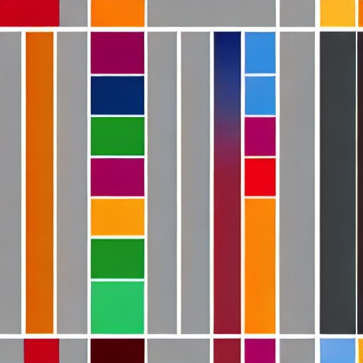
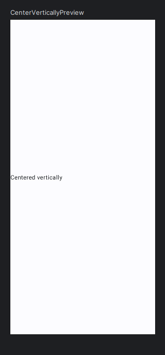
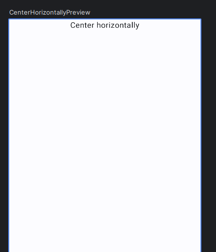

Centering with respect to the screen can be tricky in Jetpack Compose. You need to use the right layout (Column or Row) to achieve it. You have to adjust the size of the parent container to fit the screen as well. Once you follow these five simple steps, you will not have any confusion about this basic layout configuration.

## Vertically

We want to center a composable with respect of the height of the screen. So we have to use a Column with the property fill max height (or size).

You can read the article and watch this video if you want.

https://www.youtube.com/watch?v=cO1H3PMZWwM

1\. Create the screen

```
@Composable
fun CenterVerticallyScreen() {

}
```

2\. Create a preview

```
@Composable
@Preview
fun CenterVerticallyPreview() {
    AppTheme {
        Surface {
            CenterVerticallyScreen()
        }
    }
}
```

3\. Create a column with fill max size or fill max height

```
@Composable
fun CenterVerticallyScreen() {

    Column(
        modifier = Modifier.fillMaxSize()
    ){

    }
}
```

4\. Add the thing you want to center

```
@Composable
fun CenterVerticallyScreen() {

    Column(
        modifier = Modifier.fillMaxSize()
    ){
        Text("Centered vertically")
    }
}
```

5\. Add vertical arrangement

```
@Composable
fun CenterVerticallyScreen() {
    Column(
        modifier = Modifier.fillMaxSize(),
        verticalArrangement = Arrangement.Center 
    ){
        Text("Centered vertically")
    }
}
```

It looks like this:



## Horizontally

We want to center a composable with respect of the width of the screen. So we have to use a Row with the property fill max width (or size).

You can watch this video if you want

https://www.youtube.com/watch?v=RlTWB34uGSI

1\. Create the screen

```
@Composable
fun CenterHorizontallyScreen() {

}
```

2\. Create a preview

```
@Composable
@Preview
fun CenterHorizontallyPreview() {
    AppTheme {
        Surface {
            CenterHorizontallyScreen()
        }
    }
}
```

3\. Add a row with fill max size or fill max width

```
@Composable
fun CenterHorizontallyScreen() {
    Row(
        modifier = Modifier.fillMaxSize(),
    ) {
    }
}
```

4\. Add the thing you want to center

```
@Composable
fun CenterHorizontallyScreen() {
    Row(
        modifier = Modifier.fillMaxSize(),
        horizontalArrangement = Arrangement.Center // Done!
    ) {
        Text("Center horizontally")
    }
}
```



- Github: [https://github.com/FractalCodeRicardo](https://github.com/FractalCodeRicardo)

- Medium: [https://medium.com/@nosilverbullet](https://medium.com/@nosilverbullet )

- Web page: [https://programmingheadache.com](https://programmingheadache.com )

- Source code: [https://github.com/FractalCodeRicardo/programmingheadache-misc/tree/main/VerticalHorizontalAligment](https://github.com/FractalCodeRicardo/programmingheadache-misc/tree/main/VerticalHorizontalAligment)
