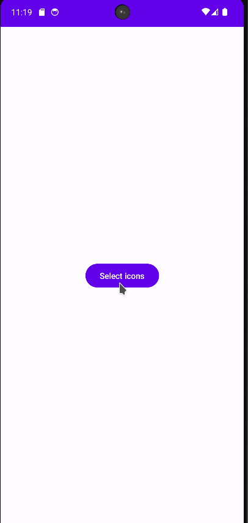
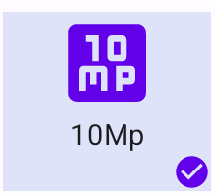
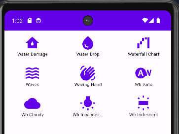
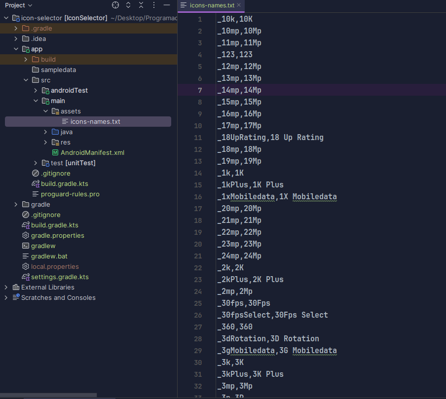
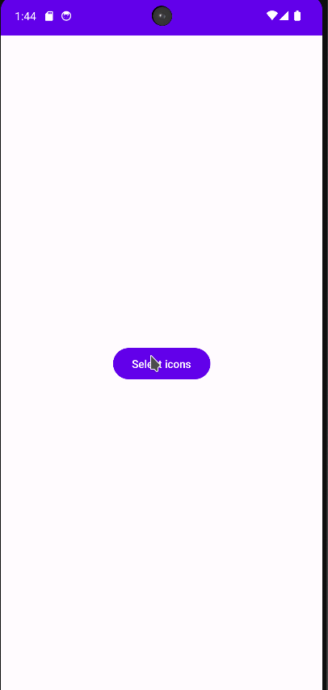

The material extended library has tons of icons that can make our apps look better. Letting users choose which icons they want to use would be really cool.

We're looking for a picker similar to the gif below



First you need to add the extended library in the build.grade.kt file (replace the version if needed)

```
implementation("androidx.compose.material:material-icons-extended:1.6.3")
```

## Basic structure

The picker is composed of a dialog with three main sections:

- The search section at the top

- The icons list at the middle

- The button's section at the bottom

So, here's our fundamental structure

```
    Dialog(
        onDismissRequest = {},

        ) {
        Column(
            modifier = Modifier
                .fillMaxWidth(0.99f)
                .fillMaxHeight(0.8f)
        ) {
            CardContainer {

                SearchTextField()

                IconsList()
                
                Buttons()
            }
        }
```

Additionally, I added a card as a container

```
@Composable
private fun CardContainer(
    content: @Composable () -> Unit
) {
    Card(
        modifier = Modifier.fillMaxSize(),
        colors = CardDefaults.elevatedCardColors()
    ) {
        Column(
            modifier = Modifier.fillMaxWidth(),
            horizontalAlignment = Alignment.CenterHorizontally,
            verticalArrangement = Arrangement.Center
        ) {
            content()
        }
    }
}

```

## Search text field

We will use a Text for the title and an OutlinedTextField for the search input

```
@Composable
private fun SearchTextField(

) {
    var search by remember { mutableStateOf("") }

    Text(text = "Select an Icon")

    OutlinedTextField(
        label = {
            Text(text = "Search")
        },
        value = search,
        onValueChange = {
            search = it
        }
    )
}
```

Then, I added a parameter for handling the search changed event. I added icons and modifiers too.

```
@Composable
private fun SearchTextField(
    onSearchChanged: (String) -> Unit
) {
    var search by remember { mutableStateOf("") }

    Text(
        modifier = Modifier.padding(10.dp),
        text = "Select an Icon",
        color = MaterialTheme.colorScheme.primary,
        fontSize = MaterialTheme.typography.headlineSmall.fontSize
    )

    OutlinedTextField(
        modifier = Modifier.height(60.dp),
        label = {
            Text(
                text = "Search",
                color = MaterialTheme.colorScheme.primary
            )
        },
        value = search,
        onValueChange = {
            search = it
            onSearchChanged(it)
        },
        colors = OutlinedTextFieldDefaults.colors(
            unfocusedBorderColor = MaterialTheme.colorScheme.primary,
            unfocusedTextColor = MaterialTheme.colorScheme.primary,
            focusedTextColor = MaterialTheme.colorScheme.primary
        ),
        trailingIcon = {
            Icon(
                Icons.Filled.Image, "Image",
                tint = MaterialTheme.colorScheme.primary
            )
        }
    )
}
```

This is how it looks


## Icons List

To handle the icon information we will use this class:

```
data class IconItem(
    var id: String = "",
    var name: String = "",
    var image: ImageVector? = null,
    var selected: Boolean = false
)
```

As we can see in the image below. Each Icon has three elements:

- The image

- The name

- The check if it is selected



The structure of the composable is the following

```
@OptIn(ExperimentalFoundationApi::class)
@Composable
private fun IconItem(
    icon: IconItem,
    selected: Boolean,
    onClick: () -> Unit
) {

    Column() {

        // Image
        Icon(
            vector, icon.name,
            tint = color,
            modifier = Modifier.size(40.dp)
        )
        
        // Name
        Text(
            text = text,
            maxLines = 1
        )

        // Check
        if (selected) {
            Row(
                modifier = Modifier.fillMaxWidth(),
                horizontalArrangement = Arrangement.End
            ) {
                Icon(
                    Icons.Filled.CheckCircle,
                    "Selected"
                )
            }
        }
    }
}
```

Then I added colors, modifiers and I implement the event.

```
@OptIn(ExperimentalFoundationApi::class)
@Composable
private fun IconItem(
    icon: IconItem,
    selected: Boolean,
    onClick: () -> Unit
) {
    val backgroundColor = if (selected)
        SoftGray
    else
        MaterialTheme.colorScheme.surface

    Column(
        modifier = Modifier
            .width(100.dp)
            .padding(10.dp)
            .combinedClickable(
                onClick = {
                    println("Single Click")
                },
                onLongClick = {
                    onClick()
                })
            .background(backgroundColor),
        horizontalAlignment = Alignment.CenterHorizontally,
        verticalArrangement = Arrangement.Center,

        ) {
        var text = "Not found"
        var vector = Icons.Filled.Image
        var color = MaterialTheme.colorScheme.error

        if (icon.image != null) {
            text = icon.name
            color = MaterialTheme.colorScheme.primary
            vector = icon.image!!
        }

        Icon(
            vector, icon.name,
            tint = color,
            modifier = Modifier.size(40.dp)
        )
        Text(
            text = text,
            fontSize = MaterialTheme.typography.labelSmall.fontSize,
            textAlign = TextAlign.Center,
            overflow = TextOverflow.Ellipsis,
            maxLines = 1
        )

        if (selected) {
            Row(
                modifier = Modifier.fillMaxWidth(),
                horizontalArrangement = Arrangement.End
            ) {
                Icon(
                    Icons.Filled.CheckCircle,
                    "Selected",
                    tint = MaterialTheme.colorScheme.primary,
                    modifier = Modifier.size(15.dp)
                )
            }
        }
    }
}
```

The list is composed of N rows each row with three items. Therefore, we will use a multidimentional list as parameter, we will add a parameter for the onClick event, too.

```
@Composable
private fun IconsList(
    icons: List<List<IconItem>>,
    onIconClick: (IconItem) -> Unit
) {
    Column(
        modifier = Modifier.fillMaxHeight(0.9f),
        horizontalAlignment = Alignment.CenterHorizontally
    ) {
        LazyColumn {
            items(
                items = icons,
                itemContent = {
                    IconListRow(
                        icons = it,
                        onClick = { onIconClick(it) }
                    )
                }
            )
        }
    }
}
```

Every row will be structured with this component

```
@Composable
private fun IconListRow(
    icons: List<IconItem>,
    onClick: (IconItem) -> Unit = {}
) {
    Row() {
        icons.forEach {
            IconItem(
                icon = it,
                selected = it.selected,
                onClick = { onClick(it) }
            )
        }
    }
}
```

This is how it appears



## Buttons

We need a button to accept or decline the icon selection. It consist in Row with the two buttons:

```
@Composable
private fun Buttons(
    onAccept: () -> Unit,
    onCancel: () -> Unit
) {
    Row {
        Button(onClick = {onCancel()}) {
            Text("Cancel")
        }

        Button(onClick = {onAccept()}) {
            Text("Accept")
        }
    }
}
```

## View Model

We require a view model capable of the following tasks:

1. Loading the displayed icon list.

3. Conducting icon searches.

5. Retaining the selected icons.

To get the whole list of icons we are going to use a special asset file (you can see it in the assets section of the project, the github repository is in the end of the article)



  
We need to convert the icon's name into an ImageVector. This can be achieved using the following snippet.

```
object ImageUtil {
    fun createImageVector(name: String): ImageVector? {
        try {
            val className = "androidx.compose.material.icons.filled.${name}Kt"
            val cl = Class.forName(className)
            val method = cl.declaredMethods.first()
            return method.invoke(null, Icons.Filled) as ImageVector
        } catch (ex: Exception) {
            Log.e("ImageNotFound", name)
            return null
        }
    }

}
```

Our view model will have this structure

```
interface IconsViewModel {

    val state: StateFlow<IconsState>

    fun updateSearch(search: String)

    fun onClickIcon(icon: IconItem)
}

data class IconsState(
    val icons: List<List<IconItem>> = emptyList(),
    val selectedIcons: MutableSet<String> = mutableSetOf(),
    val loading: Boolean = false
)
```

To update the icons, we'll first fetch the complete list of icon names from the "icon-names.txt" file.

```
private fun getNamesIcons(): List<String> {
    val inputStream = context.assets.open("icons-names.txt")
    val reader = BufferedReader(InputStreamReader(inputStream))
    val lines = reader.readLines()
    reader.close()
    return lines
}
```

Then, we'll filter them based on the search term. The result will be chunked in lists of three elements.

```
override fun updateSearch(search: String) {
    val icons = getNamesIcons()
        .filter { it.contains(search, ignoreCase = true) }
        .take(50)
        .map { parseIconItem(it) }

    val chunks = icons.chunked(3)

    updateSelection(chunks)

}

private fun updateSelection(icons: List<List<IconItem>>) {
    val selected = state.value.selectedIcons
    val newIcons = icons.map { row ->
        row.map { icon ->
            icon.copy(selected = selected.contains(icon.id))
        }
    }
    _state.update { it.copy(icons = newIcons, loading =  false, selectedIcons = selected) }
}
```

When an icon is clicked we will update the selectedIcons variable

```
override fun onClickIcon(icon: IconItem) {
   val selected = state.value.selectedIcons

   if (selected.contains(icon.id)) {
       selected.remove(icon.id)
   } else {
       selected.add(icon.id)
   }

   updateSelection(state.value.icons)
}
```

This is the final result



## Whole code of view model

```
data class IconItem(
    var id: String = "",
    var name: String = "",
    var image: ImageVector? = null,
    var selected: Boolean = false
)

interface IconsViewModel {

    val state: StateFlow<IconsState>

    fun updateSearch(search: String)

    fun onClickIcon(icon: IconItem)
}

data class IconsState(
    val icons: List<List<IconItem>> = emptyList(),
    val selectedIcons: MutableSet<String> = mutableSetOf(),
    val loading: Boolean = false
)

class IconsViewModelImp(
    val context: Context
) : IconsViewModel, ViewModel() {

    val _state = MutableStateFlow(IconsState())
    override val state = _state

    private var searchJob: Job? = null

    init {
        updateSearch("")
    }

    override fun updateSearch(search: String) {
        searchJob?.cancel()
        searchJob = viewModelScope.launch {
            delay(400)

            _state.update { it.copy(loading = true) }

            val icons = getNamesIcons()
                .filter { it.contains(search, ignoreCase = true) }
                .take(50)
                .map { parseIconItem(it) }

            val chunks = icons.chunked(3)

            updateSelection(chunks)
        }
    }

    private fun updateSelection(icons: List<List<IconItem>>) {
        val selected = state.value.selectedIcons
        val newIcons = icons.map { row ->
            row.map { icon ->
                icon.copy(selected = selected.contains(icon.id))
            }
        }
        _state.update { it.copy(icons = newIcons, loading =  false, selectedIcons = selected) }
    }

    override fun onClickIcon(icon: IconItem) {
       val selected = state.value.selectedIcons

       if (selected.contains(icon.id)) {
           selected.remove(icon.id)
       } else {
           selected.add(icon.id)
       }

       updateSelection(state.value.icons)
    }

    private fun parseIconItem(line: String): IconItem {
        val splitted = line.split(",")
        val id = splitted[0]
        val name = splitted[1]
        val image = ImageUtil.createImageVector(id)

        return IconItem(id, name, image)
    }

    private fun getNamesIcons(): List<String> {
        val inputStream = context.assets.open("icons-names.txt")
        val reader = BufferedReader(InputStreamReader(inputStream))
        val lines = reader.readLines()
        reader.close()
        return lines
    }
}
```

## Whole code of the view

```
@Composable
fun ExtendedIconsPicker(
    onSelected: (List<String>) -> Unit,
    onCancel: () -> Unit = {},
    viewModel: IconsViewModel = IconsViewModelImp(LocalContext.current)
) {

    val state by viewModel.state.collectAsState()

    Dialog(
        onDismissRequest = {},

        ) {
        Column(
            modifier = Modifier
                .fillMaxWidth(0.99f)
                .fillMaxHeight(0.8f)
        ) {
            CardContainer {

                if (state.loading) {
                    CircularProgressIndicator()
                    return@CardContainer
                }

                SearchTextField {
                    viewModel.updateSearch(it)
                }

                IconsList(
                    icons = state.icons,
                    onIconClick = {
                        viewModel.onClickIcon(it)
                    }
                )

                Buttons(
                    onAccept = {
                        onSelected(state.selectedIcons.toList())
                    },
                    onCancel = {
                        onCancel()
                    }
                )
            }
        }
    }
}

@Composable
private fun Buttons(
    onAccept: () -> Unit,
    onCancel: () -> Unit
) {
    Row {
        Button(onClick = {onCancel()}) {
            Text("Cancel")
        }

        Button(onClick = {onAccept()}) {
            Text("Accept")
        }
    }
}

@Composable
private fun SearchTextField(
    onSearchChanged: (String) -> Unit
) {
    var search by remember { mutableStateOf("") }

    Text(
        modifier = Modifier.padding(10.dp),
        text = "Select an Icon",
        color = MaterialTheme.colorScheme.primary,
        fontSize = MaterialTheme.typography.headlineSmall.fontSize
    )

    OutlinedTextField(
        modifier = Modifier.height(60.dp),
        label = {
            Text(
                text = "Search",
                color = MaterialTheme.colorScheme.primary
            )
        },
        value = search,
        onValueChange = {
            search = it
            onSearchChanged(it)
        },
        colors = OutlinedTextFieldDefaults.colors(
            unfocusedBorderColor = MaterialTheme.colorScheme.primary,
            unfocusedTextColor = MaterialTheme.colorScheme.primary,
            focusedTextColor = MaterialTheme.colorScheme.primary
        ),
        trailingIcon = {
            Icon(
                Icons.Filled.Image, "Image",
                tint = MaterialTheme.colorScheme.primary
            )
        }
    )
}

@Composable
private fun IconsList(
    icons: List<List<IconItem>>,
    onIconClick: (IconItem) -> Unit
) {
    Column(
        modifier = Modifier.fillMaxHeight(0.9f),
        horizontalAlignment = Alignment.CenterHorizontally
    ) {
        LazyColumn {
            items(
                items = icons,
                itemContent = {
                    IconListRow(
                        icons = it,
                        onClick = { onIconClick(it) }
                    )
                }
            )
        }
    }
}

@Composable
private fun IconListRow(
    icons: List<IconItem>,
    onClick: (IconItem) -> Unit = {}
) {
    Row(
        modifier = Modifier.fillMaxWidth(),
        horizontalArrangement = Arrangement.SpaceAround
    ) {
        icons.forEach {
            IconItem(
                icon = it,
                selected = it.selected,
                onClick = { onClick(it) }
            )
        }
    }
}

@OptIn(ExperimentalFoundationApi::class)
@Composable
private fun IconItem(
    icon: IconItem,
    selected: Boolean,
    onClick: () -> Unit
) {
    val backgroundColor = if (selected)
        SoftGray
    else
        MaterialTheme.colorScheme.surface

    Column(
        modifier = Modifier
            .width(100.dp)
            .padding(10.dp)
            .combinedClickable(
                onClick = {
                    println("Single Click")
                },
                onLongClick = {
                    onClick()
                })
            .background(backgroundColor),
        horizontalAlignment = Alignment.CenterHorizontally,
        verticalArrangement = Arrangement.Center,

        ) {
        var text = "Not found"
        var vector = Icons.Filled.Image
        var color = MaterialTheme.colorScheme.error

        if (icon.image != null) {
            text = icon.name
            color = MaterialTheme.colorScheme.primary
            vector = icon.image!!
        }

        Icon(
            vector, icon.name,
            tint = color,
            modifier = Modifier.size(40.dp)
        )
        Text(
            text = text,
            fontSize = MaterialTheme.typography.labelSmall.fontSize,
            textAlign = TextAlign.Center,
            overflow = TextOverflow.Ellipsis,
            maxLines = 1
        )

        if (selected) {
            Row(
                modifier = Modifier.fillMaxWidth(),
                horizontalArrangement = Arrangement.End
            ) {
                Icon(
                    Icons.Filled.CheckCircle,
                    "Selected",
                    tint = MaterialTheme.colorScheme.primary,
                    modifier = Modifier.size(15.dp)
                )
            }
        }
    }
}

@Composable
private fun CardContainer(
    content: @Composable () -> Unit
) {
    Card(
        modifier = Modifier.fillMaxSize(),
        colors = CardDefaults.elevatedCardColors()
    ) {
        Column(
            modifier = Modifier.fillMaxWidth(),
            horizontalAlignment = Alignment.CenterHorizontally,
            verticalArrangement = Arrangement.Center
        ) {
            content()
        }
    }
}
```

- Github: [https://github.com/FractalCodeRicardo](https://github.com/FractalCodeRicardo)

- Medium: [https://medium.com/@nosilverbullet](https://medium.com/@nosilverbullet )

- Web page: [https://programmingheadache.com](https://programmingheadache.com )

- Youtube: [https://www.youtube.com/@ProgrammingHeadache](https://www.youtube.com/@ProgrammingHeadache)

- Source Code: [https://github.com/FractalCodeRicardo/programmingheadache-misc/tree/main/icon-selector](https://github.com/FractalCodeRicardo/programmingheadache-misc/tree/main/icon-selector)
