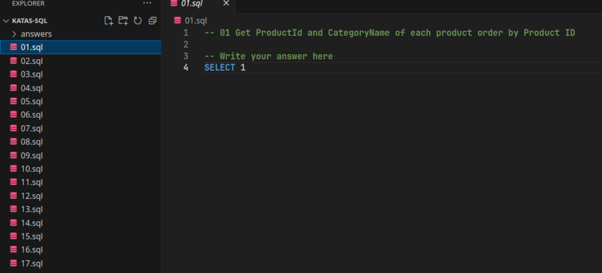
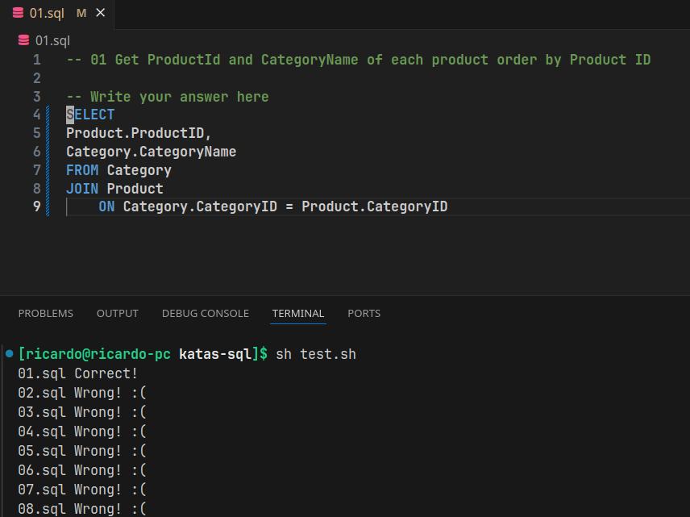

So you thought you were going to use MongoDB or DynamoDB forever? Face it! Sooner or later, you'll need to learn SQL. Mastering the basics of SQL is essential for any programmer. Whether you're working with relational databases or just want to enhance your data manipulation skills, SQL is a crucial tool in your toolkit.

To help you sharpen your SQL skills and deepen your understanding, we’ve put together a series of katas. These exercises are designed to reinforce key concepts, improve your query-writing abilities, and ensure you're well-prepared for any database challenge that comes your way. Dive in and start practicing—your future self will thank you!

1. Just clone this repository

```
git clone https://github.com/FractalCodeRicardo/katas-sql
```

2\. Install SQLite

```
// MAC
brew install sqlite

// Linux Ubuntu
sudo apt install sqlite3

// Manjaro
sudo pacman -S sqlite

// Windows
//Download from 
https://www.sqlite.org/2024/sqlite-tools-win-x64-3460100.zip

// Extract it and add the location to your Path
```

3\. Create database

```
sqlite3 sales.db < sales.sql

//or
sqlite3 sales.db ".read sales.sql"
```

4\. You are provided with a database with these tables:

```
+--------------+
|  Category    |
+--------------+
| CategoryID   | PK
| CategoryName |
+--------------+
       |
       |
+--------------+
|   Product    |
+--------------+
| ProductID    | PK
| ProductName  |
| CategoryID   | FK
+--------------+
       |
       |
+--------------+
|    Sales     |
+--------------+
| SaleID       | PK
| ProductID    | FK
| SaleDate     |
| QuantitySold |
| TotalAmount  |
+--------------+
```

5\. Every sql file has a problem that you need to solve  



You can check you answers running

```
//Linux Mac
sh test.sh

//Windows (powershell)
.\test.ps1
```



If you are stuck, you can see the answers in the "answers" folder.

Here is a list of the problems

- 01 Get ProductId and CategoryName of each product order by Product ID

- 02 Get ProductID that has been sold the most

- 03 Get CategoryName and the total amount of sales for each category

- 04 Get ProductName for product that have never been sold

- 05 Get the most selled Product Name based on the total quantity sold

- 06 Get the Sum of TotalAmout in Sales table

- 07 Get ProductName, and the date of the most recent sale

- 08 Get ProductID, and the total sales amount for products where the total sales amount exceeds 500

- 09 Get ProductID and ProductName for all products in the 'Electronics' category

- 10 Get CategoryID's that have 4 products

- 11 Get CategoryName, and the number of products in each category order by CategoryName

- 12 Get CategoryName, and the total quantity sold for all products in each category, order by CategoryName

- 13 Get SaleId highest sale for Jacket Product, based on TotalAmount

- 14 Get ProductID for products sold on '2024-08-10'

- 15 Get ProductID, and the average quantity sold for each product, order by ProductID

- 16 Get Category Name with no products

- 17 Get ProductID, and the first sale date for each product order by date

- 18 Get ProductID for products that have never been sold

- 19 Get CategoryID, CategoryName, and the number of products in the category with the most products

- 20 Get ProductID, ProductName, and the total revenue generated by each product

Links

  
Github: [https://github.com/FractalCodeRicardo](https://github.com/FractalCodeRicardo)

Medium: [https://medium.com/@nosilverbullet](https://medium.com/@nosilverbullet )

Web page: [https://programmingheadache.com](https://programmingheadache.com )

Youtube: [https://www.youtube.com/@ProgrammingHeadache](https://www.youtube.com/@ProgrammingHeadache)
